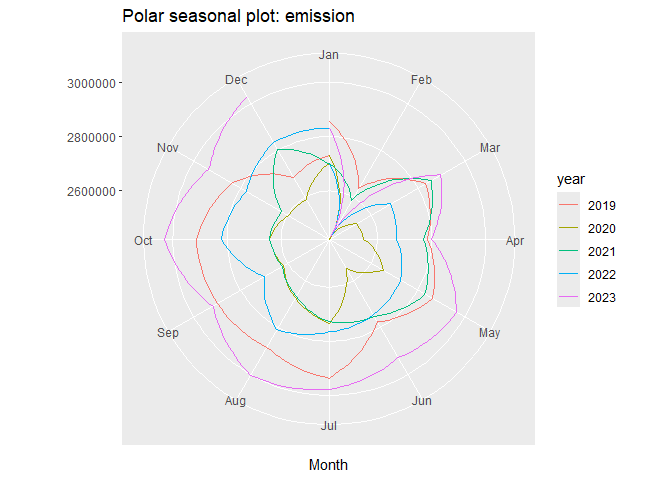
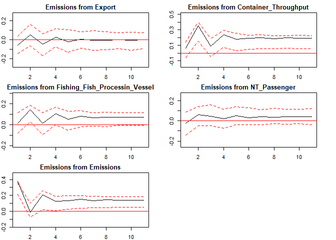

Maritime Transport CO2 Emissions of Hong Kong - Analysis & Forecast R
Code
================
Shuangjiao Deng
2024-05

## Import Data & Processing

``` r
df <- read_csv("C:/Users/NA/Downloads/HK_Emssion_2019-2023 - HK.csv", 
               col_types = cols(NT_Passenger = col_double()))
```

    ## Warning: One or more parsing issues, call `problems()` on your data frame for details,
    ## e.g.:
    ##   dat <- vroom(...)
    ##   problems(dat)

``` r
head(df)
```

    ## # A tibble: 6 × 26
    ##   Emissions Import Export TradeIndex Cargo_Throughput Container_Throughput
    ##       <dbl>  <dbl>  <dbl>      <dbl>            <dbl>                <dbl>
    ## 1   2857161  57021  56550       101.            13471                 1140
    ## 2   2639498  45102  35868       101.            10605                  865
    ## 3   2832136  55145  48774       100.            13281                 1089
    ## 4   2784408  54589  44961       101.            14083                 1099
    ## 5   2861274  54375  50538       100.            14829                 1094
    ## 6   2774563  50928  50470       101.            13367                 1039
    ## # ℹ 20 more variables: Car_Carrier <dbl>, Chemical_Carrier_Tanker <dbl>,
    ## #   Conventional_Cargo_Vessel <dbl>, `Cruise/Ferry` <dbl>,
    ## #   Dry_Bulk_Carrier <dbl>, `Fishing/Fish_Processin_Vessel` <dbl>,
    ## #   `Fully_Cellular Container_Vessel` <dbl>, `Gas_Carrier/Tanker` <dbl>,
    ## #   `Lighter/Barge/Cargo Junk` <dbl>, Oil_Tanker <dbl>, Pleasure_Vessel <dbl>,
    ## #   `Roll_On/Roll_Off` <dbl>, `Semi-container_Vessel` <dbl>, Tug <dbl>,
    ## #   Others <dbl>, Total <dbl>, NO.Cargon <dbl>, NT_Cargon <dbl>, …

### Descriptive Statistics

``` r
# Get descriptive statistics result
desc_stats <- stat.desc(df)

print(desc_stats)
```

    ##                 Emissions       Import       Export   TradeIndex
    ## nbr.val      6.000000e+01 6.000000e+01 6.000000e+01 6.000000e+01
    ## nbr.null     0.000000e+00 0.000000e+00 0.000000e+00 0.000000e+00
    ## nbr.na       0.000000e+00 0.000000e+00 0.000000e+00 0.000000e+00
    ## min          2.422401e+06 3.782800e+04 2.559100e+04 9.910000e+01
    ## max          3.031927e+06 7.928200e+04 6.806900e+04 1.014000e+02
    ## range        6.095260e+05 4.145400e+04 4.247800e+04 2.300000e+00
    ## sum          1.652024e+08 2.924404e+06 2.689478e+06 6.016200e+03
    ## median       2.758817e+06 4.833800e+04 4.575050e+04 1.004000e+02
    ## mean         2.753373e+06 4.874007e+04 4.482463e+04 1.002700e+02
    ## SE.mean      1.883438e+04 9.827994e+02 1.027284e+03 6.844933e-02
    ## CI.mean.0.95 3.768752e+04 1.966577e+03 2.055591e+03 1.369668e-01
    ## var          2.128404e+10 5.795368e+07 6.331878e+07 2.811186e-01
    ## std.dev      1.458905e+05 7.612731e+03 7.957310e+03 5.302062e-01
    ## coef.var     5.298611e-02 1.561904e-01 1.775209e-01 5.287785e-03
    ##              Cargo_Throughput Container_Throughput Car_Carrier
    ## nbr.val          6.000000e+01         6.000000e+01  48.0000000
    ## nbr.null         0.000000e+00         0.000000e+00   0.0000000
    ## nbr.na           0.000000e+00         0.000000e+00  12.0000000
    ## min              7.820000e+03         7.290000e+02   7.0000000
    ## max              1.482900e+04         1.217000e+03  22.0000000
    ## range            7.009000e+03         4.880000e+02  15.0000000
    ## sum              7.048800e+05         6.025100e+04 646.0000000
    ## median           1.206050e+04         1.037500e+03  13.0000000
    ## mean             1.174800e+04         1.004183e+03  13.4583333
    ## SE.mean          2.196969e+02         1.520780e+01   0.4972962
    ## CI.mean.0.95     4.396125e+02         3.043073e+01   1.0004309
    ## var              2.896004e+06         1.387663e+04  11.8705674
    ## std.dev          1.701765e+03         1.177991e+02   3.4453690
    ## coef.var         1.448557e-01         1.173084e-01   0.2560026
    ##              Chemical_Carrier_Tanker Conventional_Cargo_Vessel Cruise/Ferry
    ## nbr.val                   60.0000000                60.0000000    60.000000
    ## nbr.null                   0.0000000                 0.0000000    21.000000
    ## nbr.na                     0.0000000                 0.0000000     0.000000
    ## min                       11.0000000                34.0000000     0.000000
    ## max                       75.0000000               207.0000000    93.000000
    ## range                     64.0000000               173.0000000    93.000000
    ## sum                     2167.0000000              6480.0000000  1231.000000
    ## median                    36.5000000               107.5000000    11.500000
    ## mean                      36.1166667               108.0000000    20.516667
    ## SE.mean                    1.9324893                 5.6955727     3.494992
    ## CI.mean.0.95               3.8669022                11.3968146     6.993462
    ## var                      224.0709040              1946.3728814   732.898023
    ## std.dev                   14.9689981                44.1177162    27.072089
    ## coef.var                   0.4144623                 0.4084974     1.319517
    ##              Dry_Bulk_Carrier Fishing/Fish_Processin_Vessel
    ## nbr.val          6.000000e+01                    48.0000000
    ## nbr.null         0.000000e+00                     1.0000000
    ## nbr.na           0.000000e+00                    12.0000000
    ## min              5.600000e+01                     0.0000000
    ## max              6.130000e+02                    31.0000000
    ## range            5.570000e+02                    31.0000000
    ## sum              1.562600e+04                   576.0000000
    ## median           2.275000e+02                     7.0000000
    ## mean             2.604333e+02                    12.0000000
    ## SE.mean          1.519278e+01                     1.4117039
    ## CI.mean.0.95     3.040068e+01                     2.8399819
    ## var              1.384923e+04                    95.6595745
    ## std.dev          1.176828e+02                     9.7805713
    ## coef.var         4.518729e-01                     0.8150476
    ##              Fully_Cellular Container_Vessel Gas_Carrier/Tanker
    ## nbr.val                         6.000000e+01         60.0000000
    ## nbr.null                        0.000000e+00          0.0000000
    ## nbr.na                          0.000000e+00          0.0000000
    ## min                             7.850000e+02          4.0000000
    ## max                             1.378000e+03         45.0000000
    ## range                           5.930000e+02         41.0000000
    ## sum                             6.487100e+04       1160.0000000
    ## median                          1.047000e+03         19.0000000
    ## mean                            1.081183e+03         19.3333333
    ## SE.mean                         1.941537e+01          1.4747722
    ## CI.mean.0.95                    3.885008e+01          2.9510123
    ## var                             2.261741e+04        130.4971751
    ## std.dev                         1.503908e+02         11.4235360
    ## coef.var                        1.390984e-01          0.5908726
    ##              Lighter/Barge/Cargo Junk   Oil_Tanker Pleasure_Vessel
    ## nbr.val                    60.0000000   60.0000000       48.000000
    ## nbr.null                   59.0000000    0.0000000        2.000000
    ## nbr.na                      0.0000000    0.0000000       12.000000
    ## min                         0.0000000   20.0000000        0.000000
    ## max                         3.0000000  147.0000000       33.000000
    ## range                       3.0000000  127.0000000       33.000000
    ## sum                         3.0000000 3157.0000000      281.000000
    ## median                      0.0000000   47.0000000        4.000000
    ## mean                        0.0500000   52.6166667        5.854167
    ## SE.mean                     0.0500000    3.0588477        0.874678
    ## CI.mean.0.95                0.1000498    6.1207400        1.759625
    ## var                         0.1500000  561.3929379       36.722961
    ## std.dev                     0.3872983   23.6937320        6.059947
    ## coef.var                    7.7459667    0.4503085        1.035151
    ##              Roll_On/Roll_Off Semi-container_Vessel         Tug       Others
    ## nbr.val            48.0000000            60.0000000  60.0000000   60.0000000
    ## nbr.null            0.0000000             0.0000000   4.0000000    0.0000000
    ## nbr.na             12.0000000             0.0000000   0.0000000    0.0000000
    ## min                 2.0000000             4.0000000   0.0000000    2.0000000
    ## max                17.0000000            24.0000000  13.0000000  107.0000000
    ## range              15.0000000            20.0000000  13.0000000  105.0000000
    ## sum               373.0000000           578.0000000 277.0000000 1821.0000000
    ## median              7.0000000             9.5000000   4.0000000   25.5000000
    ## mean                7.7708333             9.6333333   4.6166667   30.3500000
    ## SE.mean             0.4966551             0.4806814   0.4124419    2.9558737
    ## CI.mean.0.95        0.9991412             0.9618413   0.8252943    5.9146896
    ## var                11.8399823            13.8632768  10.2064972  524.2313559
    ## std.dev             3.4409275             3.7233422   3.1947609   22.8960991
    ## coef.var            0.4428003             0.3865061   0.6920060    0.7544019
    ##                     Total    NO.Cargon    NT_Cargon No.Passenger NT_Passenger
    ## nbr.val      6.000000e+01 6.000000e+01 6.000000e+01    60.000000 4.300000e+01
    ## nbr.null     0.000000e+00 0.000000e+00 0.000000e+00     2.000000 2.000000e+00
    ## nbr.na       0.000000e+00 0.000000e+00 0.000000e+00     0.000000 1.700000e+01
    ## min          1.003000e+03 9.970000e+02 1.561500e+04     0.000000 0.000000e+00
    ## max          2.458000e+03 2.444000e+03 4.622500e+04   110.000000 3.786000e+03
    ## range        1.455000e+03 1.447000e+03 3.061000e+04   110.000000 3.786000e+03
    ## sum          9.924700e+04 9.760400e+04 1.479468e+06  1643.000000 5.632700e+04
    ## median       1.527000e+03 1.516500e+03 2.288850e+04    15.500000 8.710000e+02
    ## mean         1.654117e+03 1.626733e+03 2.465780e+04    27.383333 1.309930e+03
    ## SE.mean      4.577872e+01 4.330903e+01 7.900665e+02     3.983376 1.652364e+02
    ## CI.mean.0.95 9.160302e+01 8.666117e+01 1.580919e+03     7.970717 3.334605e+02
    ## var          1.257415e+05 1.125403e+05 3.745231e+07   952.037006 1.174032e+06
    ## std.dev      3.546005e+02 3.354703e+02 6.119829e+03    30.855097 1.083527e+03
    ## coef.var     2.143745e-01 2.062233e-01 2.481904e-01     1.126784 8.271642e-01

``` r
# Get the result dataframe  and then save as docx file
desc_stats_rounded <- round(desc_stats, 2) # round data for better display
desc_stats_df <- as.data.frame(t(desc_stats_rounded))
desc_stats_df$Index <- rownames(desc_stats_df) # set the variable names as index and rearrange it as the first col
desc_stats_df <- desc_stats_df[, c(ncol(desc_stats_df), 1:(ncol(desc_stats_df) - 1))]
# Output as docx
doc <- read_docx()
ft <- regulartable(desc_stats_df)
doc <- body_add_flextable(doc, value = ft)
print(doc, target = "desc_stats.docx")
```

### Handle dates and col names

``` r
dates <- as.yearmon((2019 + seq(0,59)/12))
df <- df %>%  mutate(Date = dates)
df <- df[,-grep('Total',colnames(df))]
names(df) <- gsub("/", "_", names(df))
```

### Check and Fill NAs

``` r
# Check NAs in each cols
colSums(is.na(df))
```

    ##                       Emissions                          Import 
    ##                               0                               0 
    ##                          Export                      TradeIndex 
    ##                               0                               0 
    ##                Cargo_Throughput            Container_Throughput 
    ##                               0                               0 
    ##                     Car_Carrier         Chemical_Carrier_Tanker 
    ##                              12                               0 
    ##       Conventional_Cargo_Vessel                    Cruise_Ferry 
    ##                               0                               0 
    ##                Dry_Bulk_Carrier   Fishing_Fish_Processin_Vessel 
    ##                               0                              12 
    ## Fully_Cellular Container_Vessel              Gas_Carrier_Tanker 
    ##                               0                               0 
    ##        Lighter_Barge_Cargo Junk                      Oil_Tanker 
    ##                               0                               0 
    ##                 Pleasure_Vessel                Roll_On_Roll_Off 
    ##                              12                              12 
    ##           Semi-container_Vessel                             Tug 
    ##                               0                               0 
    ##                          Others                       NO.Cargon 
    ##                               0                               0 
    ##                       NT_Cargon                    No.Passenger 
    ##                               0                               0 
    ##                    NT_Passenger                            Date 
    ##                              17                               0

``` r
# Set target cols
cols_to_fill <- c('Car_Carrier', 'Fishing_Fish_Processin_Vessel', "Pleasure_Vessel",'Roll_On_Roll_Off')
window_size <- 3

# Fill NAs with moving average
for (col in cols_to_fill) {
    na_index <- which(is.na(df[[col]]))
    for (i in na_index) {
      df[[col]][i] <- round(mean(df[[col]][(i-3):(i-1)], na.rm = TRUE))
    
  }
}
# The char in NT_Passenger is a sign of this value is lesser than 5. So I fill them with sampling between 1 and 5
for (i in 1:60) {
  if (is.na(df$NT_Passenger[i])) {
    df$NT_Passenger[i] <- sample(1:5, 1)
  }
}
```

### Check correlation

``` r
# Check only numeric variables
num_cols <- sapply(df, is.numeric)
num_df <- df[, num_cols]

# Calculate correlations
correlation <- cor(num_df)

# Select variables using a threshold
threshold <- 0.3
high_corr_vars <- names(which(abs(correlation["Emissions", ]) > threshold))

correlation_long <- melt(correlation)

# Heatmap
ggplot(data = correlation_long, aes(x = Var1, y = Var2, fill = value)) +
  geom_tile() +
  scale_fill_gradient2(low = "blue", high = "red", mid = "white", 
                       midpoint = 0, limit = c(-1,1), space = "Lab",
                       name="Correlation") +
  theme_minimal() +
  theme(axis.text.x = element_text(angle = 45, vjust = 1, 
                                   size = 10, hjust = 1)) +
  coord_fixed()
```

<!-- -->

``` r
# Print the variables having high correlation with Emissions
print(high_corr_vars)
```

    ## [1] "Emissions"                     "Fishing_Fish_Processin_Vessel"
    ## [3] "Gas_Carrier_Tanker"            "Pleasure_Vessel"              
    ## [5] "Others"                        "No.Passenger"

## Explore the seasonality of Emissions

``` r
emission_ts <- ts(df$Emissions,frequency = 12,start = c(2019,1))
emission_ts
```

    ##          Jan     Feb     Mar     Apr     May     Jun     Jul     Aug     Sep
    ## 2019 2857161 2639498 2832136 2784408 2861274 2774563 2935825 2883838 2899011
    ## 2020 2730699 2422401 2537214 2549464 2651546 2547200 2732768 2673055 2617030
    ## 2021 2702512 2588631 2855918 2770009 2829925 2752374 2728236 2666162 2622316
    ## 2022 2698866 2443582 2682798 2671053 2726246 2745711 2765260 2809020 2697288
    ## 2023 2830501 2433751 2896647 2799171 2964736 2929050 2976324 3002532 2918027
    ##          Oct     Nov     Dec
    ## 2019 2913457 2836337 2685011
    ## 2020 2643717 2595883 2592054
    ## 2021 2642773 2626480 2803844
    ## 2022 2821063 2774437 2834123
    ## 2023 3031927 2935808 3029714

``` r
summary(emission_ts)
```

    ##    Min. 1st Qu.  Median    Mean 3rd Qu.    Max. 
    ## 2422401 2649589 2758817 2753373 2856229 3031927

``` r
autoplot(emission_ts)
```

<!-- -->

``` r
# plot and test for seasonality
ggseasonplot(emission_ts, 
             year.labels=TRUE,
             year.labels.left=TRUE,xlabs="DOW")+
  ggtitle("Seasonal plot: emission")
```

<!-- -->

``` r
ggseasonplot(emission_ts,polar=TRUE) +
  ggtitle("Polar seasonal plot: emission")
```

<!-- -->

``` r
ggsubseriesplot(emission_ts) +
  ggtitle("Seasonal subseries plot: emission") +  theme(axis.text.x =element_blank())
```

<!-- -->

``` r
isSeasonal(emission_ts)
```

    ## [1] TRUE

``` r
kw(emission_ts)
```

    ## Test used:  Kruskall Wallis 
    ##  
    ## Test statistic:  40.56 
    ## P-value:  2.870703e-05

## Linear Regression Model

### Set Month_Offset to capture trends

``` r
baseline_date <- as.yearmon("Jan 2019")

df$Month_Offset <- as.numeric(difftime(df$Date, baseline_date, units = "days")) / 30
df <- df[,-grep('Date',colnames(df))]
df <- df[, c(2:ncol(df), 1)]

scaled_df <- as.data.frame(scale(df))
scaled_df$Month_Offset <- df$Month_Offset
```

``` r
head(scaled_df)
```

    ##       Import      Export TradeIndex Cargo_Throughput Container_Throughput
    ## 1  1.0877743  1.47353396 2.13124618        1.0124783            1.1529517
    ## 2 -0.4778924 -1.12558556 0.81100519       -0.6716556           -1.1815314
    ## 3  0.8413450  0.49631931 0.05658176        0.9008295            0.7200112
    ## 4  0.7683095  0.01713728 0.62239933        1.3721049            0.8049015
    ## 5  0.7401987  0.71800226 0.05658176        1.8104734            0.7624563
    ## 6  0.2874045  0.70945666 0.62239933        0.9513653            0.2955597
    ##   Car_Carrier Chemical_Carrier_Tanker Conventional_Cargo_Vessel Cruise_Ferry
    ## 1  -0.3045756               1.4619104                 1.0653317     1.938651
    ## 2   0.6246381               1.3283009                 0.2039997     1.901713
    ## 3   2.7928033               1.7959340                 0.3853327     2.677419
    ## 4   2.7928033               0.9274724                 1.1333316     2.234158
    ## 5   0.6246381               0.5266440                 0.1359998     1.827836
    ## 6   1.8635896              -0.2082081                 0.5893324     1.643144
    ##   Dry_Bulk_Carrier Fishing_Fish_Processin_Vessel
    ## 1        0.9395315                     1.6595154
    ## 2       -0.1736306                     1.3480318
    ## 3        0.4806708                     1.0365482
    ## 4        0.7185986                     0.8288925
    ## 5        0.5061631                     1.7633433
    ## 6        0.7101012                     1.0365482
    ##   Fully_Cellular Container_Vessel Gas_Carrier_Tanker Lighter_Barge_Cargo Junk
    ## 1                       1.9736352           1.108822               -0.1290994
    ## 2                      -0.7592439           1.108822                7.6168672
    ## 3                       1.5547267           1.546515               -0.1290994
    ## 4                       1.3685452           1.196360               -0.1290994
    ## 5                       1.4815840           1.634053               -0.1290994
    ## 6                       1.4948827           1.021283               -0.1290994
    ##   Oil_Tanker Pleasure_Vessel Roll_On_Roll_Off Semi-container_Vessel        Tug
    ## 1  1.3245416      -0.1965455       1.69148428            -0.1700981  0.4330006
    ## 2  0.3960260      -0.5650684      -1.23608467            -1.5129776  2.6240879
    ## 3  0.5226417       2.0145916       0.06505709            -0.1700981  2.3110754
    ## 4  0.7758733       2.5673759       0.39034253            -0.9758258 -1.1320618
    ## 5  1.1557206       1.4618074       1.69148428            -1.2444017  1.3720380
    ## 6  0.9868995       2.0145916       1.04091341            -0.9758258  0.4330006
    ##        Others  NO.Cargon NT_Cargon No.Passenger NT_Passenger Month_Offset
    ## 1 -0.05896201  1.6402842 1.3592210     1.640464    0.6552757     0.000000
    ## 2  0.20309136 -0.1542114 0.2289606     1.543235    0.8011270     1.033333
    ## 3 -0.23366426  1.1782463 1.0159107     2.677570    1.3221553     1.966667
    ## 4 -0.32101538  1.1931508 1.0337217     2.385884    1.4551643     3.000000
    ## 5  0.15941580  1.1335330 1.0348655     1.834921    0.6882986     4.000000
    ## 6 -0.40836651  1.1454565 1.0355191     1.770102    0.5543723     5.033333
    ##    Emissions
    ## 1  0.7114119
    ## 2 -0.7805494
    ## 3  0.5398792
    ## 4  0.2127297
    ## 5  0.7396043
    ## 6  0.1452476

### Split into train and test sets

``` r
train_rows <- 54
test_rows <- 6
# Create indices for train and test sets
train_indices <- seq_len(train_rows)
test_indices <- seq(train_rows + 1, 60)
```

``` r
# Split the DataFrame into train and test sets
train_df <- scaled_df[train_indices, ]
test_df <- scaled_df[test_indices, ]
```

### Using bestglm to select variables for lm model

``` r
lm_model <- bestglm(as.data.frame(scaled_df),IC='BIC')
summary(lm_model)
```

    ## Fitting algorithm:  BIC-leaps
    ## Best Model:
    ##            df deviance
    ## Null Model 54 17.59777
    ## Full Model 59 59.00000
    ## 
    ##  likelihood-ratio test - GLM
    ## 
    ## data:  H0: Null Model vs. H1: Best Fit BIC-leaps
    ## X = 41.402, df = 5, p-value = 7.781e-08

``` r
# Extract the selected variables from the best model
selected_vars <- names(coef(lm_model$BestModel))[-1]
print(selected_vars)
```

    ## [1] "Import"               "Container_Throughput" "Cruise_Ferry"        
    ## [4] "NT_Passenger"         "Month_Offset"

### Fit lm using selected variables and month dummies

``` r
# Fit a linear regression model using the selected variables
# Add month dummy to capture the seasonal change
months <- c("Jan", "Feb", "Mar", "Apr", "May", "Jun", "Jul", "Aug", "Sep", "Oct", "Nov", "Dec")
train_df$Month_Dummy <- rep(months, length.out = nrow(train_df))
lm <- lm(Emissions ~ ., data = train_df[, c("Emissions", selected_vars,'Month_Dummy')])
summary(lm)
```

    ## 
    ## Call:
    ## lm(formula = Emissions ~ ., data = train_df[, c("Emissions", 
    ##     selected_vars, "Month_Dummy")])
    ## 
    ## Residuals:
    ##      Min       1Q   Median       3Q      Max 
    ## -1.14419 -0.28281  0.00197  0.28970  1.03151 
    ## 
    ## Coefficients:
    ##                      Estimate Std. Error t value Pr(>|t|)    
    ## (Intercept)          -1.66210    0.40348  -4.119 0.000205 ***
    ## Import               -0.13340    0.08912  -1.497 0.142927    
    ## Container_Throughput  0.24857    0.16806   1.479 0.147599    
    ## Cruise_Ferry          1.11395    0.17298   6.440 1.60e-07 ***
    ## NT_Passenger         -0.46030    0.12640  -3.642 0.000824 ***
    ## Month_Offset          0.04857    0.01061   4.578 5.16e-05 ***
    ## Month_DummyAug        0.41529    0.36828   1.128 0.266730    
    ## Month_DummyDec        0.14622    0.37318   0.392 0.697445    
    ## Month_DummyFeb       -1.03272    0.45501  -2.270 0.029146 *  
    ## Month_DummyJan        0.28722    0.34772   0.826 0.414098    
    ## Month_DummyJul        0.49217    0.36944   1.332 0.190945    
    ## Month_DummyJun        0.13691    0.34944   0.392 0.697456    
    ## Month_DummyMar        0.20457    0.34085   0.600 0.552050    
    ## Month_DummyMay        0.51479    0.34751   1.481 0.146978    
    ## Month_DummyNov        0.04710    0.36854   0.128 0.898992    
    ## Month_DummyOct        0.45102    0.37146   1.214 0.232371    
    ## Month_DummySep        0.17393    0.37550   0.463 0.645943    
    ## ---
    ## Signif. codes:  0 '***' 0.001 '**' 0.01 '*' 0.05 '.' 0.1 ' ' 1
    ## 
    ## Residual standard error: 0.5377 on 37 degrees of freedom
    ## Multiple R-squared:  0.7455, Adjusted R-squared:  0.6355 
    ## F-statistic: 6.774 on 16 and 37 DF,  p-value: 8.283e-07

### Check Goodness

``` r
# Predict using the linear regression model
test_df$Month_Dummy <- months[7:12]
predictions <- predict(lm, newdata = test_df)

# Print R2
print(predictions)
```

    ##        55        56        57        58        59        60 
    ## 1.0886349 1.1392055 0.8920192 1.1563851 0.8155816 0.9473375

``` r
R2(predictions,test_df$Emissions)
```

    ## [1] 0.4651103

## VAR Model

### Processing

Check the selected_vars, deleted the Month_Offset and add some manually

``` r
selected_vars
```

    ## [1] "Import"               "Container_Throughput" "Cruise_Ferry"        
    ## [4] "NT_Passenger"         "Month_Offset"

``` r
selected_vars <- c(selected_vars[-length(selected_vars)])
selected_vars <- c(selected_vars,c("Export","Cargo_Throughput","Pleasure_Vessel","Fishing_Fish_Processin_Vessel","Gas_Carrier_Tanker",'Emissions'))
selected_vars
```

    ##  [1] "Import"                        "Container_Throughput"         
    ##  [3] "Cruise_Ferry"                  "NT_Passenger"                 
    ##  [5] "Export"                        "Cargo_Throughput"             
    ##  [7] "Pleasure_Vessel"               "Fishing_Fish_Processin_Vessel"
    ##  [9] "Gas_Carrier_Tanker"            "Emissions"

Check if differencing is needed Select the p of VAR

``` r
ts_df <- ts(scaled_df[,selected_vars], start = c(2019, 1), frequency = 12)
train_df <- ts_df[train_indices, ]
test_df <- ts_df[test_indices, ]

ndiffs(ts_df)
```

    ## [1] 0

``` r
VARselect(train_df,lag.max = 3)
```

    ## $selection
    ## AIC(n)  HQ(n)  SC(n) FPE(n) 
    ##      3      1      1      1 
    ## 
    ## $criteria
    ##                    1             2             3
    ## AIC(n) -1.502589e+01 -1.496449e+01 -1.672159e+01
    ## HQ(n)  -1.343368e+01 -1.192481e+01 -1.223445e+01
    ## SC(n)  -1.085921e+01 -7.009910e+00 -4.979122e+00
    ## FPE(n)  3.193215e-07  5.328142e-07  3.855541e-07

### Variable selection

``` r
var_model <- VAR(train_df, p = 1, type = "both")
summary(var_model$varresult$Emissions)
```

    ## 
    ## Call:
    ## lm(formula = y ~ -1 + ., data = datamat)
    ## 
    ## Residuals:
    ##      Min       1Q   Median       3Q      Max 
    ## -2.30792 -0.39585 -0.02257  0.46428  1.41984 
    ## 
    ## Coefficients:
    ##                                  Estimate Std. Error t value Pr(>|t|)   
    ## Import.l1                        -0.23219    0.21718  -1.069  0.29126   
    ## Container_Throughput.l1          -0.20488    0.42894  -0.478  0.63544   
    ## Cruise_Ferry.l1                   1.56253    0.60537   2.581  0.01352 * 
    ## NT_Passenger.l1                  -0.73680    0.31181  -2.363  0.02295 * 
    ## Export.l1                        -0.06858    0.25623  -0.268  0.79033   
    ## Cargo_Throughput.l1               0.55686    0.40299   1.382  0.17451   
    ## Pleasure_Vessel.l1               -0.02346    0.14516  -0.162  0.87242   
    ## Fishing_Fish_Processin_Vessel.l1 -0.29949    0.32827  -0.912  0.36693   
    ## Gas_Carrier_Tanker.l1            -0.22857    0.20818  -1.098  0.27862   
    ## Emissions.l1                      0.02223    0.21950   0.101  0.91984   
    ## const                            -2.12973    0.72988  -2.918  0.00570 **
    ## trend                             0.06593    0.02346   2.810  0.00755 **
    ## ---
    ## Signif. codes:  0 '***' 0.001 '**' 0.01 '*' 0.05 '.' 0.1 ' ' 1
    ## 
    ## Residual standard error: 0.7927 on 41 degrees of freedom
    ## Multiple R-squared:  0.3752, Adjusted R-squared:  0.2075 
    ## F-statistic: 2.238 on 11 and 41 DF,  p-value: 0.03073

``` r
# including dummy variables for months
var_model <- VAR(train_df, p = 1, type = "both",season=12)
summary(var_model$varresult$Emissions)
```

    ## 
    ## Call:
    ## lm(formula = y ~ -1 + ., data = datamat)
    ## 
    ## Residuals:
    ##      Min       1Q   Median       3Q      Max 
    ## -0.66405 -0.27737 -0.01063  0.23591  0.65212 
    ## 
    ## Coefficients:
    ##                                  Estimate Std. Error t value Pr(>|t|)    
    ## Import.l1                        -0.15833    0.14851  -1.066  0.29487    
    ## Container_Throughput.l1           0.43692    0.28303   1.544  0.13314    
    ## Cruise_Ferry.l1                   0.41308    0.51025   0.810  0.42457    
    ## NT_Passenger.l1                  -0.29182    0.27442  -1.063  0.29608    
    ## Export.l1                         0.28537    0.18085   1.578  0.12507    
    ## Cargo_Throughput.l1               0.09555    0.31538   0.303  0.76400    
    ## Pleasure_Vessel.l1               -0.08861    0.10908  -0.812  0.42302    
    ## Fishing_Fish_Processin_Vessel.l1  0.35008    0.31306   1.118  0.27234    
    ## Gas_Carrier_Tanker.l1             0.09259    0.16440   0.563  0.57750    
    ## Emissions.l1                      0.43342    0.16525   2.623  0.01357 *  
    ## const                            -1.39038    0.55729  -2.495  0.01833 *  
    ## trend                             0.04267    0.01824   2.339  0.02619 *  
    ## sd1                              -0.24345    0.37469  -0.650  0.52080    
    ## sd2                              -1.88516    0.40807  -4.620  6.8e-05 ***
    ## sd3                               1.97376    0.60585   3.258  0.00279 ** 
    ## sd4                              -0.39132    0.39057  -1.002  0.32440    
    ## sd5                               0.53610    0.36906   1.453  0.15671    
    ## sd6                              -0.47476    0.38787  -1.224  0.23047    
    ## sd7                               0.36064    0.38406   0.939  0.35522    
    ## sd8                              -0.39298    0.43730  -0.899  0.37599    
    ## sd9                              -0.52650    0.37861  -1.391  0.17458    
    ## sd10                              0.07914    0.38712   0.204  0.83940    
    ## sd11                             -0.16012    0.37303  -0.429  0.67081    
    ## ---
    ## Signif. codes:  0 '***' 0.001 '**' 0.01 '*' 0.05 '.' 0.1 ' ' 1
    ## 
    ## Residual standard error: 0.463 on 30 degrees of freedom
    ## Multiple R-squared:  0.8441, Adjusted R-squared:  0.7297 
    ## F-statistic: 7.381 on 22 and 30 DF,  p-value: 5.307e-07

### Build VAR model

``` r
selected_vars <- c("Export","Container_Throughput","Fishing_Fish_Processin_Vessel","NT_Passenger","Emissions")
var_model <- VAR(train_df[,selected_vars], p = 1, type = "both",season = 12)
summary(var_model$varresult$Emissions)
```

    ## 
    ## Call:
    ## lm(formula = y ~ -1 + ., data = datamat)
    ## 
    ## Residuals:
    ##      Min       1Q   Median       3Q      Max 
    ## -0.66036 -0.30127  0.02336  0.26450  0.68074 
    ## 
    ## Coefficients:
    ##                                   Estimate Std. Error t value Pr(>|t|)    
    ## Export.l1                         0.141419   0.100646   1.405 0.168803    
    ## Container_Throughput.l1           0.516470   0.157962   3.270 0.002421 ** 
    ## Fishing_Fish_Processin_Vessel.l1  0.580957   0.120000   4.841 2.59e-05 ***
    ## NT_Passenger.l1                  -0.053126   0.069357  -0.766 0.448828    
    ## Emissions.l1                      0.396380   0.125598   3.156 0.003283 ** 
    ## const                            -0.957197   0.225467  -4.245 0.000153 ***
    ## trend                             0.028224   0.006909   4.085 0.000244 ***
    ## sd1                              -0.221307   0.315067  -0.702 0.487067    
    ## sd2                              -1.837012   0.298317  -6.158 4.79e-07 ***
    ## sd3                               1.989962   0.407244   4.886 2.26e-05 ***
    ## sd4                              -0.208441   0.301343  -0.692 0.493683    
    ## sd5                               0.598749   0.297375   2.013 0.051808 .  
    ## sd6                              -0.330333   0.311788  -1.059 0.296639    
    ## sd7                               0.518027   0.315238   1.643 0.109278    
    ## sd8                              -0.145671   0.323489  -0.450 0.655262    
    ## sd9                              -0.461549   0.313609  -1.472 0.150028    
    ## sd10                              0.108824   0.311027   0.350 0.728522    
    ## sd11                             -0.216908   0.314553  -0.690 0.495007    
    ## ---
    ## Signif. codes:  0 '***' 0.001 '**' 0.01 '*' 0.05 '.' 0.1 ' ' 1
    ## 
    ## Residual standard error: 0.4384 on 35 degrees of freedom
    ## Multiple R-squared:  0.8369, Adjusted R-squared:  0.7577 
    ## F-statistic: 10.56 on 17 and 35 DF,  p-value: 3.482e-09

### Forecast

``` r
pred_var <- predict(var_model,n.ahead=6)
pred_var
```

    ## $Export
    ##            fcst     lower     upper       CI
    ## [1,] -0.7875936 -1.806696 0.2315087 1.019102
    ## [2,] -0.5741992 -1.759964 0.6115657 1.185765
    ## [3,] -0.8204981 -2.103987 0.4629908 1.283489
    ## [4,] -1.3309327 -2.697150 0.0352851 1.366218
    ## [5,] -0.9755343 -2.416656 0.4655880 1.441122
    ## [6,] -1.0760927 -2.585168 0.4329830 1.509076
    ## 
    ## $Container_Throughput
    ##            fcst     lower        upper        CI
    ## [1,] -0.8460291 -1.693992  0.001933883 0.8479630
    ## [2,] -1.1696276 -2.101382 -0.237872803 0.9317548
    ## [3,] -1.5147685 -2.511953 -0.517584338 0.9971842
    ## [4,] -1.6166124 -2.668145 -0.565080199 1.0515322
    ## [5,] -1.5497760 -2.650097 -0.449455473 1.1003206
    ## [6,] -1.3941467 -2.539280 -0.249013577 1.1451331
    ## 
    ## $Fishing_Fish_Processin_Vessel
    ##           fcst       lower    upper        CI
    ## [1,] 0.9571197  0.20753968 1.706700 0.7495801
    ## [2,] 1.2899165  0.24885135 2.330982 1.0410651
    ## [3,] 1.4214833  0.16473697 2.678230 1.2567463
    ## [4,] 1.3963029 -0.03327731 2.825883 1.4295802
    ## [5,] 1.2913634 -0.28057807 2.863305 1.5719415
    ## [6,] 1.5992646 -0.09165687 3.290186 1.6909215
    ## 
    ## $NT_Passenger
    ##             fcst     lower     upper        CI
    ## [1,] -0.06804226 -1.064556 0.9284718 0.9965141
    ## [2,]  0.13418402 -1.283250 1.5516185 1.4174345
    ## [3,]  0.09067713 -1.544090 1.7254438 1.6347667
    ## [4,]  0.09017131 -1.691892 1.8722343 1.7820630
    ## [5,] -0.07440268 -1.963056 1.8142502 1.8886529
    ## [6,]  0.25509914 -1.713741 2.2239394 1.9688402
    ## 
    ## $Emissions
    ##           fcst      lower    upper        CI
    ## [1,] 1.3499806  0.4907741 2.209187 0.8592065
    ## [2,] 1.0412423 -0.0737092 2.156194 1.1149515
    ## [3,] 0.6768569 -0.5682849 1.921999 1.2451418
    ## [4,] 0.9966779 -0.3394977 2.332853 1.3361756
    ## [5,] 0.6865542 -0.7142041 2.087312 1.4007583
    ## [6,] 0.8413164 -0.6056798 2.288313 1.4469962

``` r
R2(pred_var$fcst$Emissions[,1],as.data.frame(test_df)$Emissions)
```

    ## [1] 0.1881313

## VECM Model

``` r
new_df <- df[,selected_vars]
```

### Stationary

``` r
# Adf test
ts_df <- ts(scaled_df[,selected_vars], start = c(2019, 1), frequency = 12)
adf_results <- apply(ts_df, 2, function(x) adf.test(x, alternative = "stationary"))
print(adf_results)
```

    ## $Export
    ## 
    ##  Augmented Dickey-Fuller Test
    ## 
    ## data:  x
    ## Dickey-Fuller = -1.3864, Lag order = 3, p-value = 0.8228
    ## alternative hypothesis: stationary
    ## 
    ## 
    ## $Container_Throughput
    ## 
    ##  Augmented Dickey-Fuller Test
    ## 
    ## data:  x
    ## Dickey-Fuller = -1.8594, Lag order = 3, p-value = 0.6316
    ## alternative hypothesis: stationary
    ## 
    ## 
    ## $Fishing_Fish_Processin_Vessel
    ## 
    ##  Augmented Dickey-Fuller Test
    ## 
    ## data:  x
    ## Dickey-Fuller = -1.2609, Lag order = 3, p-value = 0.8735
    ## alternative hypothesis: stationary
    ## 
    ## 
    ## $NT_Passenger
    ## 
    ##  Augmented Dickey-Fuller Test
    ## 
    ## data:  x
    ## Dickey-Fuller = -2.6156, Lag order = 3, p-value = 0.326
    ## alternative hypothesis: stationary
    ## 
    ## 
    ## $Emissions
    ## 
    ##  Augmented Dickey-Fuller Test
    ## 
    ## data:  x
    ## Dickey-Fuller = -2.131, Lag order = 3, p-value = 0.5218
    ## alternative hypothesis: stationary

``` r
#pp test
pp_results <- apply(ts_df, 2, function(x) pp.test(x, alternative = "stationary"))
```

    ## Warning in pp.test(x, alternative = "stationary"): p-value smaller than printed
    ## p-value
    ## Warning in pp.test(x, alternative = "stationary"): p-value smaller than printed
    ## p-value
    ## Warning in pp.test(x, alternative = "stationary"): p-value smaller than printed
    ## p-value

``` r
print(pp_results)
```

    ## $Export
    ## 
    ##  Phillips-Perron Unit Root Test
    ## 
    ## data:  x
    ## Dickey-Fuller Z(alpha) = -26.993, Truncation lag parameter = 3, p-value
    ## = 0.01
    ## alternative hypothesis: stationary
    ## 
    ## 
    ## $Container_Throughput
    ## 
    ##  Phillips-Perron Unit Root Test
    ## 
    ## data:  x
    ## Dickey-Fuller Z(alpha) = -35.424, Truncation lag parameter = 3, p-value
    ## = 0.01
    ## alternative hypothesis: stationary
    ## 
    ## 
    ## $Fishing_Fish_Processin_Vessel
    ## 
    ##  Phillips-Perron Unit Root Test
    ## 
    ## data:  x
    ## Dickey-Fuller Z(alpha) = -4.6065, Truncation lag parameter = 3, p-value
    ## = 0.846
    ## alternative hypothesis: stationary
    ## 
    ## 
    ## $NT_Passenger
    ## 
    ##  Phillips-Perron Unit Root Test
    ## 
    ## data:  x
    ## Dickey-Fuller Z(alpha) = -11.408, Truncation lag parameter = 3, p-value
    ## = 0.4342
    ## alternative hypothesis: stationary
    ## 
    ## 
    ## $Emissions
    ## 
    ##  Phillips-Perron Unit Root Test
    ## 
    ## data:  x
    ## Dickey-Fuller Z(alpha) = -30.756, Truncation lag parameter = 3, p-value
    ## = 0.01
    ## alternative hypothesis: stationary

differencing

``` r
diff_ts_df <- diff(ts_df,1)
# adf test
adf_results <- apply(diff_ts_df, 2, function(x) adf.test(x, alternative = "stationary"))
```

    ## Warning in adf.test(x, alternative = "stationary"): p-value smaller than
    ## printed p-value
    ## Warning in adf.test(x, alternative = "stationary"): p-value smaller than
    ## printed p-value
    ## Warning in adf.test(x, alternative = "stationary"): p-value smaller than
    ## printed p-value

``` r
print(adf_results)
```

    ## $Export
    ## 
    ##  Augmented Dickey-Fuller Test
    ## 
    ## data:  x
    ## Dickey-Fuller = -4.2768, Lag order = 3, p-value = 0.01
    ## alternative hypothesis: stationary
    ## 
    ## 
    ## $Container_Throughput
    ## 
    ##  Augmented Dickey-Fuller Test
    ## 
    ## data:  x
    ## Dickey-Fuller = -5.5393, Lag order = 3, p-value = 0.01
    ## alternative hypothesis: stationary
    ## 
    ## 
    ## $Fishing_Fish_Processin_Vessel
    ## 
    ##  Augmented Dickey-Fuller Test
    ## 
    ## data:  x
    ## Dickey-Fuller = -3.9384, Lag order = 3, p-value = 0.01847
    ## alternative hypothesis: stationary
    ## 
    ## 
    ## $NT_Passenger
    ## 
    ##  Augmented Dickey-Fuller Test
    ## 
    ## data:  x
    ## Dickey-Fuller = -3.095, Lag order = 3, p-value = 0.1324
    ## alternative hypothesis: stationary
    ## 
    ## 
    ## $Emissions
    ## 
    ##  Augmented Dickey-Fuller Test
    ## 
    ## data:  x
    ## Dickey-Fuller = -4.6238, Lag order = 3, p-value = 0.01
    ## alternative hypothesis: stationary

``` r
# pp test
pp_results <- apply(diff_ts_df, 2, function(x) pp.test(x, alternative = "stationary"))
```

    ## Warning in pp.test(x, alternative = "stationary"): p-value smaller than printed
    ## p-value
    ## Warning in pp.test(x, alternative = "stationary"): p-value smaller than printed
    ## p-value
    ## Warning in pp.test(x, alternative = "stationary"): p-value smaller than printed
    ## p-value
    ## Warning in pp.test(x, alternative = "stationary"): p-value smaller than printed
    ## p-value
    ## Warning in pp.test(x, alternative = "stationary"): p-value smaller than printed
    ## p-value

``` r
print(pp_results)
```

    ## $Export
    ## 
    ##  Phillips-Perron Unit Root Test
    ## 
    ## data:  x
    ## Dickey-Fuller Z(alpha) = -80.756, Truncation lag parameter = 3, p-value
    ## = 0.01
    ## alternative hypothesis: stationary
    ## 
    ## 
    ## $Container_Throughput
    ## 
    ##  Phillips-Perron Unit Root Test
    ## 
    ## data:  x
    ## Dickey-Fuller Z(alpha) = -73.643, Truncation lag parameter = 3, p-value
    ## = 0.01
    ## alternative hypothesis: stationary
    ## 
    ## 
    ## $Fishing_Fish_Processin_Vessel
    ## 
    ##  Phillips-Perron Unit Root Test
    ## 
    ## data:  x
    ## Dickey-Fuller Z(alpha) = -62.343, Truncation lag parameter = 3, p-value
    ## = 0.01
    ## alternative hypothesis: stationary
    ## 
    ## 
    ## $NT_Passenger
    ## 
    ##  Phillips-Perron Unit Root Test
    ## 
    ## data:  x
    ## Dickey-Fuller Z(alpha) = -40.416, Truncation lag parameter = 3, p-value
    ## = 0.01
    ## alternative hypothesis: stationary
    ## 
    ## 
    ## $Emissions
    ## 
    ##  Phillips-Perron Unit Root Test
    ## 
    ## data:  x
    ## Dickey-Fuller Z(alpha) = -87.63, Truncation lag parameter = 3, p-value
    ## = 0.01
    ## alternative hypothesis: stationary

### Build VECM model

``` r
train_df <- diff_ts_df[train_indices, ]
test_df <- diff_ts_df[test_indices[-6], ]
```

``` r
jo.dtdata <- ca.jo(train_df,type=c("trace"),ecdet = c("trend"),K=2,season=12)
summary(jo.dtdata)
```

    ## 
    ## ###################### 
    ## # Johansen-Procedure # 
    ## ###################### 
    ## 
    ## Test type: trace statistic , with linear trend in cointegration 
    ## 
    ## Eigenvalues (lambda):
    ## [1] 6.199595e-01 4.699146e-01 4.564032e-01 3.848686e-01 2.141775e-01
    ## [6] 2.775558e-17
    ## 
    ## Values of teststatistic and critical values of test:
    ## 
    ##            test 10pct  5pct  1pct
    ## r <= 4 |  12.53 10.49 12.25 16.26
    ## r <= 3 |  37.80 22.76 25.32 30.45
    ## r <= 2 |  69.50 39.06 42.44 48.45
    ## r <= 1 | 102.50 59.14 62.99 70.05
    ## r = 0  | 152.81 83.20 87.31 96.58
    ## 
    ## Eigenvectors, normalised to first column:
    ## (These are the cointegration relations)
    ## 
    ##                                     Export.l2 Container_Throughput.l2
    ## Export.l2                          1.00000000            1.0000000000
    ## Container_Throughput.l2          -12.55278727           -0.9733062828
    ## Fishing_Fish_Processin_Vessel.l2  -6.81305116            0.9874212551
    ## NT_Passenger.l2                    1.15176812           -0.4251779808
    ## Emissions.l2                       5.35900978           -0.7726408356
    ## trend.l2                          -0.01329082           -0.0008037137
    ##                                  Fishing_Fish_Processin_Vessel.l2
    ## Export.l2                                              1.00000000
    ## Container_Throughput.l2                                0.89086800
    ## Fishing_Fish_Processin_Vessel.l2                      -1.63598730
    ## NT_Passenger.l2                                       -0.83276408
    ## Emissions.l2                                           0.33005940
    ## trend.l2                                               0.01677267
    ##                                  NT_Passenger.l2 Emissions.l2   trend.l2
    ## Export.l2                            1.000000000   1.00000000  1.0000000
    ## Container_Throughput.l2              0.622033293  -0.44653364  4.2312730
    ## Fishing_Fish_Processin_Vessel.l2     0.718043703  -2.08570191  2.5186959
    ## NT_Passenger.l2                      0.641309524   1.37414830 -3.9668307
    ## Emissions.l2                         0.683988672  -2.00583692  4.2063456
    ## trend.l2                            -0.004999288   0.01468547 -0.9469213
    ## 
    ## Weights W:
    ## (This is the loading matrix)
    ## 
    ##                                   Export.l2 Container_Throughput.l2
    ## Export.d                        -0.02372791              -0.4168358
    ## Container_Throughput.d           0.08636136               0.3807752
    ## Fishing_Fish_Processin_Vessel.d  0.04211314              -0.2102377
    ## NT_Passenger.d                  -0.02490249               0.3686836
    ## Emissions.d                     -0.10298892               0.1949731
    ##                                 Fishing_Fish_Processin_Vessel.l2
    ## Export.d                                            -0.197897834
    ## Container_Throughput.d                              -0.178874126
    ## Fishing_Fish_Processin_Vessel.d                      0.284875942
    ## NT_Passenger.d                                       0.365317487
    ## Emissions.d                                         -0.005788885
    ##                                 NT_Passenger.l2 Emissions.l2      trend.l2
    ## Export.d                            -0.63166610  -0.03877804 -1.558053e-16
    ## Container_Throughput.d              -0.19729292   0.05623980 -3.019319e-16
    ## Fishing_Fish_Processin_Vessel.d     -0.12823414   0.09147514 -3.769535e-17
    ## NT_Passenger.d                      -0.18828446  -0.09617894  5.615500e-18
    ## Emissions.d                         -0.02728085   0.15562583 -2.215538e-16

When r=0, we cannot reject the null hypothesis of no cointegration. It
indicates the presence of cointegration in the data. We can reject r\<=3
but can not reject r\<=4 on 1pct. So r=4.

``` r
vecm <- cajorls(jo.dtdata,r=4)
summary(vecm$rlm)
```

    ## Response Export.d :
    ## 
    ## Call:
    ## lm(formula = Export.d ~ ect1 + ect2 + ect3 + ect4 + constant + 
    ##     sd1 + sd2 + sd3 + sd4 + sd5 + sd6 + sd7 + sd8 + sd9 + sd10 + 
    ##     sd11 + Export.dl1 + Container_Throughput.dl1 + Fishing_Fish_Processin_Vessel.dl1 + 
    ##     NT_Passenger.dl1 + Emissions.dl1 - 1, data = data.mat)
    ## 
    ## Residuals:
    ##      Min       1Q   Median       3Q      Max 
    ## -1.07452 -0.29158  0.02072  0.26148  1.36674 
    ## 
    ## Coefficients:
    ##                                   Estimate Std. Error t value Pr(>|t|)    
    ## ect1                              -1.27013    0.27719  -4.582 7.09e-05 ***
    ## ect2                               0.13434    0.41423   0.324  0.74787    
    ## ect3                              -0.37974    0.35452  -1.071  0.29238    
    ## ect4                              -0.09039    0.17828  -0.507  0.61573    
    ## constant                          -0.04093    0.10399  -0.394  0.69657    
    ## sd1                               -1.54853    0.45978  -3.368  0.00204 ** 
    ## sd2                                0.74282    0.79540   0.934  0.35757    
    ## sd3                                0.14538    1.02222   0.142  0.88783    
    ## sd4                               -0.10813    0.82671  -0.131  0.89678    
    ## sd5                               -0.07497    0.42707  -0.176  0.86179    
    ## sd6                                0.30938    0.44554   0.694  0.49261    
    ## sd7                                0.27718    0.47071   0.589  0.56022    
    ## sd8                               -0.06493    0.46436  -0.140  0.88970    
    ## sd9                               -0.60439    0.46587  -1.297  0.20409    
    ## sd10                               0.20289    0.46867   0.433  0.66809    
    ## sd11                               0.05441    0.44285   0.123  0.90300    
    ## Export.dl1                        -1.34222    0.17728  -7.571 1.56e-08 ***
    ## Container_Throughput.dl1           0.01559    0.22245   0.070  0.94458    
    ## Fishing_Fish_Processin_Vessel.dl1 -0.26425    0.23852  -1.108  0.27644    
    ## NT_Passenger.dl1                  -0.12054    0.20062  -0.601  0.55230    
    ## Emissions.dl1                     -0.09210    0.18732  -0.492  0.62643    
    ## ---
    ## Signif. codes:  0 '***' 0.001 '**' 0.01 '*' 0.05 '.' 0.1 ' ' 1
    ## 
    ## Residual standard error: 0.5766 on 31 degrees of freedom
    ## Multiple R-squared:  0.9063, Adjusted R-squared:  0.8429 
    ## F-statistic: 14.28 on 21 and 31 DF,  p-value: 1.264e-10
    ## 
    ## 
    ## Response Container_Throughput.d :
    ## 
    ## Call:
    ## lm(formula = Container_Throughput.d ~ ect1 + ect2 + ect3 + ect4 + 
    ##     constant + sd1 + sd2 + sd3 + sd4 + sd5 + sd6 + sd7 + sd8 + 
    ##     sd9 + sd10 + sd11 + Export.dl1 + Container_Throughput.dl1 + 
    ##     Fishing_Fish_Processin_Vessel.dl1 + NT_Passenger.dl1 + Emissions.dl1 - 
    ##     1, data = data.mat)
    ## 
    ## Residuals:
    ##      Min       1Q   Median       3Q      Max 
    ## -0.68299 -0.24885 -0.03629  0.13496  1.17091 
    ## 
    ## Coefficients:
    ##                                     Estimate Std. Error t value Pr(>|t|)    
    ## ect1                               0.0909695  0.2125796   0.428 0.671659    
    ## ect2                              -1.7367626  0.3176691  -5.467 5.62e-06 ***
    ## ect3                              -0.0614279  0.2718813  -0.226 0.822734    
    ## ect4                              -0.0399949  0.1367202  -0.293 0.771830    
    ## constant                           0.0266999  0.0797531   0.335 0.740044    
    ## sd1                               -1.3650156  0.3526023  -3.871 0.000522 ***
    ## sd2                                1.1701342  0.6099898   1.918 0.064326 .  
    ## sd3                                1.3063069  0.7839345   1.666 0.105719    
    ## sd4                                0.7220916  0.6340000   1.139 0.263451    
    ## sd5                                0.3135012  0.3275165   0.957 0.345869    
    ## sd6                                0.2924709  0.3416802   0.856 0.398578    
    ## sd7                                0.2157469  0.3609868   0.598 0.554409    
    ## sd8                                0.0003571  0.3561156   0.001 0.999206    
    ## sd9                                0.1046971  0.3572767   0.293 0.771443    
    ## sd10                               0.4227826  0.3594200   1.176 0.248433    
    ## sd11                               0.5693897  0.3396199   1.677 0.103688    
    ## Export.dl1                         0.0674255  0.1359556   0.496 0.623436    
    ## Container_Throughput.dl1          -1.5910186  0.1705981  -9.326 1.65e-10 ***
    ## Fishing_Fish_Processin_Vessel.dl1 -0.2298077  0.1829205  -1.256 0.218383    
    ## NT_Passenger.dl1                   0.1387352  0.1538545   0.902 0.374153    
    ## Emissions.dl1                     -0.0591913  0.1436558  -0.412 0.683149    
    ## ---
    ## Signif. codes:  0 '***' 0.001 '**' 0.01 '*' 0.05 '.' 0.1 ' ' 1
    ## 
    ## Residual standard error: 0.4422 on 31 degrees of freedom
    ## Multiple R-squared:  0.9414, Adjusted R-squared:  0.9017 
    ## F-statistic: 23.73 on 21 and 31 DF,  p-value: 1.222e-13
    ## 
    ## 
    ## Response Fishing_Fish_Processin_Vessel.d :
    ## 
    ## Call:
    ## lm(formula = Fishing_Fish_Processin_Vessel.d ~ ect1 + ect2 + 
    ##     ect3 + ect4 + constant + sd1 + sd2 + sd3 + sd4 + sd5 + sd6 + 
    ##     sd7 + sd8 + sd9 + sd10 + sd11 + Export.dl1 + Container_Throughput.dl1 + 
    ##     Fishing_Fish_Processin_Vessel.dl1 + NT_Passenger.dl1 + Emissions.dl1 - 
    ##     1, data = data.mat)
    ## 
    ## Residuals:
    ##      Min       1Q   Median       3Q      Max 
    ## -0.70634 -0.20318  0.01435  0.17257  1.11959 
    ## 
    ## Coefficients:
    ##                                    Estimate Std. Error t value Pr(>|t|)    
    ## ect1                              -0.011483   0.185982  -0.062 0.951165    
    ## ect2                              -0.149991   0.277923  -0.540 0.593270    
    ## ect3                              -1.052643   0.237864  -4.425 0.000111 ***
    ## ect4                              -0.181579   0.119614  -1.518 0.139137    
    ## constant                          -0.154195   0.069775  -2.210 0.034626 *  
    ## sd1                               -0.732318   0.308485  -2.374 0.023977 *  
    ## sd2                                0.088204   0.533669   0.165 0.869798    
    ## sd3                               -0.207657   0.685850  -0.303 0.764085    
    ## sd4                                0.032306   0.554675   0.058 0.953929    
    ## sd5                               -0.111928   0.286538  -0.391 0.698749    
    ## sd6                               -0.218849   0.298930  -0.732 0.469602    
    ## sd7                                0.262069   0.315821   0.830 0.412995    
    ## sd8                               -0.003514   0.311559  -0.011 0.991073    
    ## sd9                                0.032896   0.312575   0.105 0.916863    
    ## sd10                              -0.156020   0.314450  -0.496 0.623277    
    ## sd11                               0.023960   0.297127   0.081 0.936248    
    ## Export.dl1                         0.127951   0.118945   1.076 0.290356    
    ## Container_Throughput.dl1          -0.091500   0.149253  -0.613 0.544315    
    ## Fishing_Fish_Processin_Vessel.dl1 -1.081628   0.160034  -6.759 1.45e-07 ***
    ## NT_Passenger.dl1                   0.034618   0.134605   0.257 0.798734    
    ## Emissions.dl1                      0.103266   0.125682   0.822 0.417551    
    ## ---
    ## Signif. codes:  0 '***' 0.001 '**' 0.01 '*' 0.05 '.' 0.1 ' ' 1
    ## 
    ## Residual standard error: 0.3868 on 31 degrees of freedom
    ## Multiple R-squared:  0.766,  Adjusted R-squared:  0.6075 
    ## F-statistic: 4.832 on 21 and 31 DF,  p-value: 4.222e-05
    ## 
    ## 
    ## Response NT_Passenger.d :
    ## 
    ## Call:
    ## lm(formula = NT_Passenger.d ~ ect1 + ect2 + ect3 + ect4 + constant + 
    ##     sd1 + sd2 + sd3 + sd4 + sd5 + sd6 + sd7 + sd8 + sd9 + sd10 + 
    ##     sd11 + Export.dl1 + Container_Throughput.dl1 + Fishing_Fish_Processin_Vessel.dl1 + 
    ##     NT_Passenger.dl1 + Emissions.dl1 - 1, data = data.mat)
    ## 
    ## Residuals:
    ##      Min       1Q   Median       3Q      Max 
    ## -0.81175 -0.21924 -0.03404  0.26457  0.96046 
    ## 
    ## Coefficients:
    ##                                   Estimate Std. Error t value Pr(>|t|)    
    ## ect1                               0.52081    0.23363   2.229 0.033182 *  
    ## ect2                               0.16208    0.34912   0.464 0.645707    
    ## ect3                              -0.19914    0.29880  -0.666 0.510040    
    ## ect4                              -0.61041    0.15026  -4.062 0.000307 ***
    ## constant                          -0.19695    0.08765  -2.247 0.031900 *  
    ## sd1                               -0.20952    0.38752  -0.541 0.592597    
    ## sd2                                0.29069    0.67039   0.434 0.667571    
    ## sd3                                0.15681    0.86156   0.182 0.856758    
    ## sd4                                0.06614    0.69678   0.095 0.924993    
    ## sd5                                0.62963    0.35995   1.749 0.090148 .  
    ## sd6                                0.60816    0.37551   1.620 0.115461    
    ## sd7                                0.46989    0.39673   1.184 0.245251    
    ## sd8                                0.17218    0.39138   0.440 0.663040    
    ## sd9                                0.36768    0.39265   0.936 0.356310    
    ## sd10                               0.46957    0.39501   1.189 0.243561    
    ## sd11                               0.45684    0.37325   1.224 0.230193    
    ## Export.dl1                         0.42289    0.14942   2.830 0.008091 ** 
    ## Container_Throughput.dl1           0.12835    0.18749   0.685 0.498697    
    ## Fishing_Fish_Processin_Vessel.dl1 -0.18211    0.20103  -0.906 0.371997    
    ## NT_Passenger.dl1                  -0.57788    0.16909  -3.418 0.001786 ** 
    ## Emissions.dl1                     -0.35174    0.15788  -2.228 0.033281 *  
    ## ---
    ## Signif. codes:  0 '***' 0.001 '**' 0.01 '*' 0.05 '.' 0.1 ' ' 1
    ## 
    ## Residual standard error: 0.486 on 31 degrees of freedom
    ## Multiple R-squared:  0.6699, Adjusted R-squared:  0.4463 
    ## F-statistic: 2.996 on 21 and 31 DF,  p-value: 0.002774
    ## 
    ## 
    ## Response Emissions.d :
    ## 
    ## Call:
    ## lm(formula = Emissions.d ~ ect1 + ect2 + ect3 + ect4 + constant + 
    ##     sd1 + sd2 + sd3 + sd4 + sd5 + sd6 + sd7 + sd8 + sd9 + sd10 + 
    ##     sd11 + Export.dl1 + Container_Throughput.dl1 + Fishing_Fish_Processin_Vessel.dl1 + 
    ##     NT_Passenger.dl1 + Emissions.dl1 - 1, data = data.mat)
    ## 
    ## Residuals:
    ##      Min       1Q   Median       3Q      Max 
    ## -0.68263 -0.29818  0.01415  0.27037  0.88826 
    ## 
    ## Coefficients:
    ##                                    Estimate Std. Error t value Pr(>|t|)    
    ## ect1                               0.058914   0.239268   0.246 0.807129    
    ## ect2                               1.080903   0.357550   3.023 0.004988 ** 
    ## ect3                               0.884071   0.306014   2.889 0.006992 ** 
    ## ect4                              -0.214192   0.153884  -1.392 0.173858    
    ## constant                           0.025977   0.089766   0.289 0.774214    
    ## sd1                               -1.444107   0.396869  -3.639 0.000986 ***
    ## sd2                                3.855800   0.686570   5.616 3.67e-06 ***
    ## sd3                               -1.294124   0.882352  -1.467 0.152536    
    ## sd4                                0.003869   0.713594   0.005 0.995709    
    ## sd5                               -0.565265   0.368634  -1.533 0.135320    
    ## sd6                                0.490126   0.384576   1.274 0.211972    
    ## sd7                               -0.244777   0.406306  -0.602 0.551260    
    ## sd8                               -0.375247   0.400823  -0.936 0.356411    
    ## sd9                                0.736218   0.402130   1.831 0.076759 .  
    ## sd10                               0.030158   0.404543   0.075 0.941053    
    ## sd11                              -0.035956   0.382257  -0.094 0.925665    
    ## Export.dl1                         0.228661   0.153024   1.494 0.145212    
    ## Container_Throughput.dl1           0.815225   0.192016   4.246 0.000184 ***
    ## Fishing_Fish_Processin_Vessel.dl1  0.456989   0.205885   2.220 0.033892 *  
    ## NT_Passenger.dl1                   0.078377   0.173170   0.453 0.653987    
    ## Emissions.dl1                     -1.024110   0.161691  -6.334 4.76e-07 ***
    ## ---
    ## Signif. codes:  0 '***' 0.001 '**' 0.01 '*' 0.05 '.' 0.1 ' ' 1
    ## 
    ## Residual standard error: 0.4977 on 31 degrees of freedom
    ## Multiple R-squared:  0.9468, Adjusted R-squared:  0.9108 
    ## F-statistic: 26.29 on 21 and 31 DF,  p-value: 2.867e-14

### Forecast

``` r
vecm_model <- vec2var(jo.dtdata)
pred_vecm <- predict(vecm_model,n.ahead = 5)
R2(pred_vecm$fcst$Emissions[,1],as.data.frame(test_df)$Emissions)
```

    ## [1] 0.8539341

## Forecast with a final VECM model

``` r
jo.dtdata <- ca.jo(diff_ts_df,type=c("trace"),ecdet = c("trend"),K=2,season=12)
summary(jo.dtdata)
```

    ## 
    ## ###################### 
    ## # Johansen-Procedure # 
    ## ###################### 
    ## 
    ## Test type: trace statistic , with linear trend in cointegration 
    ## 
    ## Eigenvalues (lambda):
    ## [1] 0.6280144 0.4754480 0.4269221 0.3750342 0.2137906 0.0000000
    ## 
    ## Values of teststatistic and critical values of test:
    ## 
    ##            test 10pct  5pct  1pct
    ## r <= 4 |  13.71 10.49 12.25 16.26
    ## r <= 3 |  40.50 22.76 25.32 30.45
    ## r <= 2 |  72.24 39.06 42.44 48.45
    ## r <= 1 | 109.01 59.14 62.99 70.05
    ## r = 0  | 165.38 83.20 87.31 96.58
    ## 
    ## Eigenvectors, normalised to first column:
    ## (These are the cointegration relations)
    ## 
    ##                                     Export.l2 Container_Throughput.l2
    ## Export.l2                          1.00000000             1.000000000
    ## Container_Throughput.l2          -23.77494585            -0.775410363
    ## Fishing_Fish_Processin_Vessel.l2 -12.17601091             0.671052174
    ## NT_Passenger.l2                    2.35405328            -0.458416124
    ## Emissions.l2                      10.39543538            -0.616041354
    ## trend.l2                          -0.04273309             0.001411137
    ##                                  Fishing_Fish_Processin_Vessel.l2
    ## Export.l2                                             1.000000000
    ## Container_Throughput.l2                               1.032347668
    ## Fishing_Fish_Processin_Vessel.l2                     -1.444671551
    ## NT_Passenger.l2                                      -0.574228204
    ## Emissions.l2                                          0.713090331
    ## trend.l2                                              0.009159685
    ##                                  NT_Passenger.l2 Emissions.l2   trend.l2
    ## Export.l2                            1.000000000   1.00000000  1.0000000
    ## Container_Throughput.l2              0.579496303  -0.51550049  5.9856753
    ## Fishing_Fish_Processin_Vessel.l2     0.985970369  -2.15652114  3.5238587
    ## NT_Passenger.l2                      0.858977882   1.30409936 -3.9217956
    ## Emissions.l2                         0.683883985  -1.89061408  2.3548682
    ## trend.l2                            -0.005042878   0.01232186 -0.7737016
    ## 
    ## Weights W:
    ## (This is the loading matrix)
    ## 
    ##                                   Export.l2 Container_Throughput.l2
    ## Export.d                        -0.01335548              -0.5434778
    ## Container_Throughput.d           0.04636529               0.4021294
    ## Fishing_Fish_Processin_Vessel.d  0.02148921              -0.1929768
    ## NT_Passenger.d                  -0.01497481               0.4703376
    ## Emissions.d                     -0.05837786               0.1986517
    ##                                 Fishing_Fish_Processin_Vessel.l2
    ## Export.d                                             -0.23520304
    ## Container_Throughput.d                               -0.23519527
    ## Fishing_Fish_Processin_Vessel.d                       0.28800449
    ## NT_Passenger.d                                        0.28585778
    ## Emissions.d                                          -0.06358308
    ##                                 NT_Passenger.l2 Emissions.l2      trend.l2
    ## Export.d                            -0.49614839  -0.04019578 -2.667016e-16
    ## Container_Throughput.d              -0.13641583   0.05997002 -2.721104e-16
    ## Fishing_Fish_Processin_Vessel.d     -0.16101229   0.09844392 -4.499430e-17
    ## NT_Passenger.d                      -0.23158109  -0.09197829 -1.258350e-17
    ## Emissions.d                         -0.01474557   0.15736161 -3.084895e-16

``` r
vecm <- cajorls(jo.dtdata,r=4)
summary(vecm$rlm)
```

    ## Response Export.d :
    ## 
    ## Call:
    ## lm(formula = Export.d ~ ect1 + ect2 + ect3 + ect4 + constant + 
    ##     sd1 + sd2 + sd3 + sd4 + sd5 + sd6 + sd7 + sd8 + sd9 + sd10 + 
    ##     sd11 + Export.dl1 + Container_Throughput.dl1 + Fishing_Fish_Processin_Vessel.dl1 + 
    ##     NT_Passenger.dl1 + Emissions.dl1 - 1, data = data.mat)
    ## 
    ## Residuals:
    ##      Min       1Q   Median       3Q      Max 
    ## -1.07370 -0.29903  0.03365  0.29958  1.37865 
    ## 
    ## Coefficients:
    ##                                   Estimate Std. Error t value Pr(>|t|)    
    ## ect1                              -1.28818    0.25971  -4.960  1.7e-05 ***
    ## ect2                               0.20862    0.38422   0.543  0.59050    
    ## ect3                              -0.35148    0.31346  -1.121  0.26959    
    ## ect4                              -0.07342    0.17040  -0.431  0.66914    
    ## constant                          -0.03013    0.08624  -0.349  0.72884    
    ## sd1                               -1.54489    0.43685  -3.536  0.00114 ** 
    ## sd2                                0.69907    0.74719   0.936  0.35571    
    ## sd3                                0.42867    0.92020   0.466  0.64413    
    ## sd4                               -0.31257    0.75375  -0.415  0.68083    
    ## sd5                               -0.03375    0.40457  -0.083  0.93397    
    ## sd6                                0.26716    0.42056   0.635  0.52928    
    ## sd7                                0.26690    0.41624   0.641  0.52544    
    ## sd8                               -0.19054    0.40551  -0.470  0.64128    
    ## sd9                               -0.51325    0.42018  -1.221  0.22984    
    ## sd10                               0.20973    0.42904   0.489  0.62792    
    ## sd11                               0.13062    0.40159   0.325  0.74686    
    ## Export.dl1                        -1.36957    0.16478  -8.311  6.8e-10 ***
    ## Container_Throughput.dl1           0.03106    0.20959   0.148  0.88300    
    ## Fishing_Fish_Processin_Vessel.dl1 -0.23226    0.21441  -1.083  0.28591    
    ## NT_Passenger.dl1                  -0.11496    0.18936  -0.607  0.54758    
    ## Emissions.dl1                     -0.13731    0.17110  -0.803  0.42753    
    ## ---
    ## Signif. codes:  0 '***' 0.001 '**' 0.01 '*' 0.05 '.' 0.1 ' ' 1
    ## 
    ## Residual standard error: 0.5494 on 36 degrees of freedom
    ## Multiple R-squared:  0.9022, Adjusted R-squared:  0.8451 
    ## F-statistic: 15.81 on 21 and 36 DF,  p-value: 2.106e-12
    ## 
    ## 
    ## Response Container_Throughput.d :
    ## 
    ## Call:
    ## lm(formula = Container_Throughput.d ~ ect1 + ect2 + ect3 + ect4 + 
    ##     constant + sd1 + sd2 + sd3 + sd4 + sd5 + sd6 + sd7 + sd8 + 
    ##     sd9 + sd10 + sd11 + Export.dl1 + Container_Throughput.dl1 + 
    ##     Fishing_Fish_Processin_Vessel.dl1 + NT_Passenger.dl1 + Emissions.dl1 - 
    ##     1, data = data.mat)
    ## 
    ## Residuals:
    ##      Min       1Q   Median       3Q      Max 
    ## -0.73921 -0.22238 -0.03128  0.15085  1.16216 
    ## 
    ## Coefficients:
    ##                                   Estimate Std. Error t value Pr(>|t|)    
    ## ect1                               0.07688    0.19840   0.388 0.700655    
    ## ect2                              -1.73600    0.29352  -5.914 9.04e-07 ***
    ## ect3                              -0.08942    0.23947  -0.373 0.711041    
    ## ect4                              -0.05732    0.13018  -0.440 0.662348    
    ## constant                           0.01270    0.06588   0.193 0.848204    
    ## sd1                               -1.36810    0.33373  -4.099 0.000225 ***
    ## sd2                                1.18122    0.57081   2.069 0.045747 *  
    ## sd3                                1.18446    0.70298   1.685 0.100655    
    ## sd4                                0.78553    0.57582   1.364 0.180976    
    ## sd5                                0.28765    0.30906   0.931 0.358197    
    ## sd6                                0.30530    0.32128   0.950 0.348314    
    ## sd7                                0.25802    0.31798   0.811 0.422460    
    ## sd8                                0.07332    0.30978   0.237 0.814240    
    ## sd9                                0.12168    0.32099   0.379 0.706857    
    ## sd10                               0.40116    0.32776   1.224 0.228924    
    ## sd11                               0.47442    0.30679   1.546 0.130755    
    ## Export.dl1                         0.07133    0.12588   0.567 0.574464    
    ## Container_Throughput.dl1          -1.58626    0.16011  -9.907 7.96e-12 ***
    ## Fishing_Fish_Processin_Vessel.dl1 -0.24937    0.16380  -1.522 0.136638    
    ## NT_Passenger.dl1                   0.12755    0.14466   0.882 0.383773    
    ## Emissions.dl1                     -0.04471    0.13071  -0.342 0.734291    
    ## ---
    ## Signif. codes:  0 '***' 0.001 '**' 0.01 '*' 0.05 '.' 0.1 ' ' 1
    ## 
    ## Residual standard error: 0.4197 on 36 degrees of freedom
    ## Multiple R-squared:  0.939,  Adjusted R-squared:  0.9034 
    ## F-statistic:  26.4 on 21 and 36 DF,  p-value: 6.109e-16
    ## 
    ## 
    ## Response Fishing_Fish_Processin_Vessel.d :
    ## 
    ## Call:
    ## lm(formula = Fishing_Fish_Processin_Vessel.d ~ ect1 + ect2 + 
    ##     ect3 + ect4 + constant + sd1 + sd2 + sd3 + sd4 + sd5 + sd6 + 
    ##     sd7 + sd8 + sd9 + sd10 + sd11 + Export.dl1 + Container_Throughput.dl1 + 
    ##     Fishing_Fish_Processin_Vessel.dl1 + NT_Passenger.dl1 + Emissions.dl1 - 
    ##     1, data = data.mat)
    ## 
    ## Residuals:
    ##      Min       1Q   Median       3Q      Max 
    ## -0.76402 -0.18722 -0.00886  0.13739  1.07680 
    ## 
    ## Coefficients:
    ##                                   Estimate Std. Error t value Pr(>|t|)    
    ## ect1                              -0.04450    0.17678  -0.252   0.8027    
    ## ect2                              -0.15725    0.26153  -0.601   0.5514    
    ## ect3                              -0.96598    0.21337  -4.527 6.31e-05 ***
    ## ect4                              -0.16464    0.11599  -1.419   0.1644    
    ## constant                          -0.09760    0.05870  -1.663   0.1051    
    ## sd1                               -0.72115    0.29736  -2.425   0.0204 *  
    ## sd2                                0.22040    0.50860   0.433   0.6674    
    ## sd3                               -0.33712    0.62636  -0.538   0.5937    
    ## sd4                                0.11559    0.51306   0.225   0.8230    
    ## sd5                               -0.15093    0.27538  -0.548   0.5870    
    ## sd6                               -0.20150    0.28627  -0.704   0.4860    
    ## sd7                                0.13196    0.28333   0.466   0.6442    
    ## sd8                               -0.03903    0.27602  -0.141   0.8883    
    ## sd9                                0.02929    0.28601   0.102   0.9190    
    ## sd10                              -0.18752    0.29204  -0.642   0.5249    
    ## sd11                              -0.02750    0.27335  -0.101   0.9204    
    ## Export.dl1                         0.12861    0.11217   1.147   0.2591    
    ## Container_Throughput.dl1          -0.08300    0.14266  -0.582   0.5643    
    ## Fishing_Fish_Processin_Vessel.dl1 -1.02782    0.14595  -7.042 2.89e-08 ***
    ## NT_Passenger.dl1                   0.05610    0.12889   0.435   0.6660    
    ## Emissions.dl1                      0.13851    0.11647   1.189   0.2421    
    ## ---
    ## Signif. codes:  0 '***' 0.001 '**' 0.01 '*' 0.05 '.' 0.1 ' ' 1
    ## 
    ## Residual standard error: 0.374 on 36 degrees of freedom
    ## Multiple R-squared:  0.7461, Adjusted R-squared:  0.5979 
    ## F-statistic: 5.037 on 21 and 36 DF,  p-value: 1.129e-05
    ## 
    ## 
    ## Response NT_Passenger.d :
    ## 
    ## Call:
    ## lm(formula = NT_Passenger.d ~ ect1 + ect2 + ect3 + ect4 + constant + 
    ##     sd1 + sd2 + sd3 + sd4 + sd5 + sd6 + sd7 + sd8 + sd9 + sd10 + 
    ##     sd11 + Export.dl1 + Container_Throughput.dl1 + Fishing_Fish_Processin_Vessel.dl1 + 
    ##     NT_Passenger.dl1 + Emissions.dl1 - 1, data = data.mat)
    ## 
    ## Residuals:
    ##      Min       1Q   Median       3Q      Max 
    ## -0.83044 -0.19552 -0.04881  0.21678  0.99332 
    ## 
    ## Coefficients:
    ##                                   Estimate Std. Error t value Pr(>|t|)    
    ## ect1                               0.50964    0.21480   2.373 0.023125 *  
    ## ect2                               0.15222    0.31778   0.479 0.634815    
    ## ect3                              -0.14335    0.25926  -0.553 0.583739    
    ## ect4                              -0.61393    0.14094  -4.356 0.000105 ***
    ## constant                          -0.15656    0.07133  -2.195 0.034702 *  
    ## sd1                               -0.21853    0.36131  -0.605 0.549089    
    ## sd2                                0.35684    0.61799   0.577 0.567254    
    ## sd3                                0.08381    0.76108   0.110 0.912921    
    ## sd4                                0.10271    0.62341   0.165 0.870058    
    ## sd5                                0.59780    0.33461   1.787 0.082433 .  
    ## sd6                                0.60957    0.34784   1.752 0.088209 .  
    ## sd7                                0.44077    0.34426   1.280 0.208616    
    ## sd8                                0.11263    0.33539   0.336 0.738956    
    ## sd9                                0.34045    0.34753   0.980 0.333804    
    ## sd10                               0.44227    0.35485   1.246 0.220687    
    ## sd11                               0.38445    0.33215   1.157 0.254707    
    ## Export.dl1                         0.43099    0.13629   3.162 0.003173 ** 
    ## Container_Throughput.dl1           0.12376    0.17334   0.714 0.479852    
    ## Fishing_Fish_Processin_Vessel.dl1 -0.14687    0.17734  -0.828 0.413011    
    ## NT_Passenger.dl1                  -0.58047    0.15662  -3.706 0.000703 ***
    ## Emissions.dl1                     -0.33014    0.14152  -2.333 0.025358 *  
    ## ---
    ## Signif. codes:  0 '***' 0.001 '**' 0.01 '*' 0.05 '.' 0.1 ' ' 1
    ## 
    ## Residual standard error: 0.4544 on 36 degrees of freedom
    ## Multiple R-squared:  0.6719, Adjusted R-squared:  0.4804 
    ## F-statistic:  3.51 on 21 and 36 DF,  p-value: 0.0004591
    ## 
    ## 
    ## Response Emissions.d :
    ## 
    ## Call:
    ## lm(formula = Emissions.d ~ ect1 + ect2 + ect3 + ect4 + constant + 
    ##     sd1 + sd2 + sd3 + sd4 + sd5 + sd6 + sd7 + sd8 + sd9 + sd10 + 
    ##     sd11 + Export.dl1 + Container_Throughput.dl1 + Fishing_Fish_Processin_Vessel.dl1 + 
    ##     NT_Passenger.dl1 + Emissions.dl1 - 1, data = data.mat)
    ## 
    ## Residuals:
    ##      Min       1Q   Median       3Q      Max 
    ## -0.79687 -0.27249 -0.02879  0.25179  0.86831 
    ## 
    ## Coefficients:
    ##                                   Estimate Std. Error t value Pr(>|t|)    
    ## ect1                               0.06195    0.22364   0.277 0.783378    
    ## ect2                               1.15971    0.33086   3.505 0.001241 ** 
    ## ect3                               0.92143    0.26993   3.414 0.001601 ** 
    ## ect4                              -0.20464    0.14674  -1.395 0.171687    
    ## constant                           0.01066    0.07426   0.144 0.886685    
    ## sd1                               -1.46959    0.37619  -3.907 0.000396 ***
    ## sd2                                3.70514    0.64344   5.758 1.46e-06 ***
    ## sd3                               -0.87305    0.79242  -1.102 0.277882    
    ## sd4                               -0.25493    0.64908  -0.393 0.696816    
    ## sd5                               -0.50352    0.34839  -1.445 0.157027    
    ## sd6                                0.42353    0.36216   1.169 0.249898    
    ## sd7                               -0.06093    0.35844  -0.170 0.865961    
    ## sd8                               -0.49285    0.34920  -1.411 0.166718    
    ## sd9                                0.75476    0.36183   2.086 0.044132 *  
    ## sd10                               0.01373    0.36946   0.037 0.970564    
    ## sd11                               0.02605    0.34582   0.075 0.940375    
    ## Export.dl1                         0.20225    0.14190   1.425 0.162692    
    ## Container_Throughput.dl1           0.81699    0.18048   4.527 6.32e-05 ***
    ## Fishing_Fish_Processin_Vessel.dl1  0.48093    0.18464   2.605 0.013282 *  
    ## NT_Passenger.dl1                   0.06030    0.16306   0.370 0.713711    
    ## Emissions.dl1                     -1.10739    0.14734  -7.516 7.00e-09 ***
    ## ---
    ## Signif. codes:  0 '***' 0.001 '**' 0.01 '*' 0.05 '.' 0.1 ' ' 1
    ## 
    ## Residual standard error: 0.4731 on 36 degrees of freedom
    ## Multiple R-squared:  0.9465, Adjusted R-squared:  0.9153 
    ## F-statistic: 30.34 on 21 and 36 DF,  p-value: < 2.2e-16

``` r
vecm_model <- vec2var(jo.dtdata)
pred_diff_df <- predict(vecm_model,n.ahead = 7*12)
print(pred_diff_df$fcst$Emissions)
```

    ##               fcst      lower      upper        CI
    ##  [1,] -0.402319958 -1.1620698  0.3574299 0.7597499
    ##  [2,] -1.761624411 -2.8407003 -0.6825485 1.0790759
    ##  [3,]  1.738140237  0.5645371  2.9117433 1.1736031
    ##  [4,] -0.406825511 -1.7129913  0.8993403 1.3061658
    ##  [5,]  0.610254112 -0.7765968  1.9971050 1.3868509
    ##  [6,] -0.452445512 -1.9283474  1.0234564 1.4759019
    ##  [7,]  0.490233874 -1.0664179  2.0468856 1.5566518
    ##  [8,] -0.189857363 -1.8221607  1.4424460 1.6323033
    ##  [9,] -0.435657092 -2.1420760  1.2707618 1.7064189
    ## [10,]  0.364782474 -1.4110048  2.1405697 1.7757873
    ## [11,] -0.439568162 -2.2832552  1.4041189 1.8436871
    ## [12,]  0.194370357 -1.7140780  2.1028187 1.9084483
    ## [13,] -0.064773609 -2.0362761  1.9067289 1.9715025
    ## [14,] -1.872683093 -3.9050610  0.1596948 2.0323779
    ## [15,]  1.785371231 -0.3062137  3.8769562 2.0915849
    ## [16,] -0.364845000 -2.5139727  1.7842827 2.1491277
    ## [17,]  0.606088195 -1.5990796  2.8112560 2.2051678
    ## [18,] -0.409722916 -2.6695577  1.8501119 2.2598348
    ## [19,]  0.501493246 -1.8116979  2.8146844 2.3131912
    ## [20,] -0.162342583 -2.5277031  2.2030179 2.3653605
    ## [21,] -0.414335260 -2.8307275  2.0020570 2.4163923
    ## [22,]  0.387112326 -2.0792630  2.8534877 2.4663754
    ## [23,] -0.416221515 -2.9315834  2.0991403 2.5153618
    ## [24,]  0.216285035 -2.3471287  2.7796988 2.5634138
    ## [25,] -0.041645634 -2.6522268  2.5689355 2.6105812
    ## [26,] -1.850402327 -4.5073133  0.8065087 2.6569110
    ## [27,]  1.808175737 -0.8942715  4.5106229 2.7024472
    ## [28,] -0.342330586 -3.0895589  2.4048977 2.7472283
    ## [29,]  0.628741770 -2.1625496  3.4200331 2.7912913
    ## [30,] -0.387119462 -3.2217888  2.4475499 2.8346693
    ## [31,]  0.524099728 -2.3532938  3.4014933 2.8773936
    ## [32,] -0.139718464 -3.0592111  2.7797741 2.9194926
    ## [33,] -0.391734156 -3.3527273  2.5692590 2.9609932
    ## [34,]  0.409734102 -2.5921859  3.4116541 3.0019200
    ## [35,] -0.393615135 -3.4359115  2.6486812 3.0422964
    ## [36,]  0.238901312 -2.8432425  3.3210452 3.0821438
    ## [37,] -0.019034791 -3.1405175  3.1024479 3.1214827
    ## [38,] -1.827789126 -4.9881210  1.3325427 3.1603318
    ## [39,]  1.830788402 -1.3679208  5.0294976 3.1987092
    ## [40,] -0.319718276 -3.5563499  2.9169133 3.2366316
    ## [41,]  0.651354736 -2.6227600  3.9254695 3.2741148
    ## [42,] -0.364507136 -3.6756808  2.9466665 3.3111736
    ## [43,]  0.546712546 -2.8011098  3.8945349 3.3478223
    ## [44,] -0.117105968 -3.5011801  3.2669682 3.3840741
    ## [45,] -0.369121480 -3.7890632  3.0508202 3.4199417
    ## [46,]  0.432346697 -3.0230902  3.8877836 3.4554369
    ## [47,] -0.371002518 -3.8615738  3.1195688 3.4905713
    ## [48,]  0.261513936 -3.2638415  3.7868694 3.5253555
    ## [49,]  0.003577815 -3.5562220  3.5633776 3.5597998
    ## [50,] -1.805176501 -5.3990905  1.7887375 3.5939140
    ## [51,]  1.853401012 -1.7743064  5.4811085 3.6277074
    ## [52,] -0.297105656 -3.9582946  3.3640833 3.6611890
    ## [53,]  0.673967350 -3.0203997  4.3683344 3.6943671
    ## [54,] -0.341894519 -4.0691444  3.3853553 3.7272499
    ## [55,]  0.569325163 -3.1905199  4.3291702 3.7598451
    ## [56,] -0.094493352 -3.8866535  3.6976667 3.7921601
    ## [57,] -0.346508863 -4.1707110  3.4776932 3.8242021
    ## [58,]  0.454959313 -3.4010185  4.3109371 3.8559778
    ## [59,] -0.348389901 -4.2358837  3.5391039 3.8874938
    ## [60,]  0.284126552 -3.6346299  4.2028830 3.9187564
    ## [61,]  0.026190431 -3.9235811  3.9759620 3.9497715
    ## [62,] -1.782563885 -5.7631089  2.1979811 3.9805450
    ## [63,]  1.876013629 -2.1350688  5.8870960 4.0110824
    ## [64,] -0.274493040 -4.3158821  3.7668960 4.0413890
    ## [65,]  0.696579966 -3.3748901  4.7680501 4.0714701
    ## [66,] -0.319281903 -4.4206124  3.7820486 4.1013305
    ## [67,]  0.591937779 -3.5390373  4.7229129 4.1309751
    ## [68,] -0.071880736 -4.2322892  4.0885278 4.1604085
    ## [69,] -0.323896247 -4.5135313  3.8657388 4.1896351
    ## [70,]  0.477571929 -3.7410873  4.6962311 4.2186592
    ## [71,] -0.325777285 -4.5732623  3.9217077 4.2474850
    ## [72,]  0.306739169 -3.9693773  4.5828557 4.2761165
    ## [73,]  0.048803048 -4.2557545  4.3533606 4.3045575
    ## [74,] -1.759951268 -6.0927632  2.5728606 4.3328119
    ## [75,]  1.898626245 -2.4622570  6.2595095 4.3608832
    ## [76,] -0.251880423 -4.6406554  4.1368946 4.3887750
    ## [77,]  0.719192583 -3.6972980  5.1356832 4.4164906
    ## [78,] -0.296669287 -4.7407027  4.1473641 4.4440334
    ## [79,]  0.614550395 -3.8568561  5.0859569 4.4714065
    ## [80,] -0.049268120 -4.5478812  4.4493449 4.4986130
    ## [81,] -0.301283630 -4.8269397  4.2243724 4.5256561
    ## [82,]  0.500184546 -4.0523539  5.0527230 4.5525384
    ## [83,] -0.303164669 -4.8824277  4.2760983 4.5792630
    ## [84,]  0.329351785 -4.2764807  4.9351843 4.6058325

### Plot the true value and forecast diff_value

``` r
emissions <- as.vector(as.data.frame(diff_ts_df)$Emissions)
pred <- as.vector(unlist(pred_diff_df$fcst$Emissions[,1]))
emission_pred <- c(emissions,pred)

fcst <- pred_diff_df$fcst$Emissions[, "fcst"]
lower <- pred_diff_df$fcst$Emissions[, "lower"]
upper <- pred_diff_df$fcst$Emissions[, "upper"]

time_index <- as.yearmon((2024 + seq(0,83)/12))


plot_data <- data.frame(Time = c(dates[-1],time_index),
                        Emissions = c(as.data.frame(diff_ts_df)$Emissions, fcst),
                        Lower = c(rep(NA, length(as.data.frame(diff_ts_df)$Emissions)), lower),
                        Upper = c(rep(NA, length(as.data.frame(diff_ts_df)$Emissions)), upper),
                        Type = c(rep("Actual", length(as.data.frame(diff_ts_df)$Emissions)), rep("Forecast", length(fcst))))
# Plot
ggplot(plot_data, aes(x = Time, y = Emissions, color = Type)) +
  geom_line() +
  geom_ribbon(aes(ymin = Lower, ymax = Upper, fill = Type), alpha = 0.2) +
  labs(x = "Time", y = "Emissions", title = "Actual vs Forecast diff_Emissions") +
  theme_minimal()
```

    ## Warning: The `trans` argument of `continuous_scale()` is deprecated as of ggplot2 3.5.0.
    ## ℹ Please use the `transform` argument instead.
    ## This warning is displayed once every 8 hours.
    ## Call `lifecycle::last_lifecycle_warnings()` to see where this warning was
    ## generated.

    ## Warning in max(ids, na.rm = TRUE): no non-missing arguments to max; returning
    ## -Inf

<!-- -->

### De-differencing and plot

``` r
de_diff_ts <- cumsum(emission_pred) + head(as.data.frame(ts_df)$Emissions, 1)
de_diff_ts<- ts(de_diff_ts,frequency = 12,start = c(2019,2))
autoplot(de_diff_ts)
```

<!-- -->

### De-scaling and plot

``` r
mean <- mean(df$Emissions)
stdv <- sd(df$Emissions)
recover_ts <- de_diff_ts * stdv + mean
recover_ts <- as.data.frame(c(df$Emissions[1],recover_ts))
names(recover_ts) <- c("Emission")
recover_ts$Date <- c(dates,time_index)
ggplot(recover_ts, aes(x = Date, y = Emission, color = "line")) +
  geom_line() +
  geom_line(data = recover_ts[60:nrow(recover_ts), ], aes(colour = "after_60")) +
  labs(x = "Date", y = "Emission") +
  theme_minimal() +
  scale_color_manual(values = c("line" = "black", "after_60" = "blue"),
                     labels = c("Emissions", "Forecast"))
```

<!-- --> \### Print
the forecast result

``` r
print(tail(recover_ts, 7*12))
```

    ##     Emission     Date
    ## 61   2971019 Jan 2024
    ## 62   2714015 Feb 2024
    ## 63   2967593 Mar 2024
    ## 64   2908241 Apr 2024
    ## 65   2997272 May 2024
    ## 66   2931264 Jun 2024
    ## 67   3002784 Jul 2024
    ## 68   2975086 Aug 2024
    ## 69   2911528 Sep 2024
    ## 70   2964746 Oct 2024
    ## 71   2900617 Nov 2024
    ## 72   2928974 Dec 2024
    ## 73   2919524 Jan 2025
    ## 74   2646318 Feb 2025
    ## 75   2906786 Mar 2025
    ## 76   2853559 Apr 2025
    ## 77   2941981 May 2025
    ## 78   2882207 Jun 2025
    ## 79   2955370 Jul 2025
    ## 80   2931686 Aug 2025
    ## 81   2871238 Sep 2025
    ## 82   2927714 Oct 2025
    ## 83   2866991 Nov 2025
    ## 84   2898545 Dec 2025
    ## 85   2892469 Jan 2026
    ## 86   2622513 Feb 2026
    ## 87   2886309 Mar 2026
    ## 88   2836366 Apr 2026
    ## 89   2928094 May 2026
    ## 90   2871617 Jun 2026
    ## 91   2948078 Jul 2026
    ## 92   2927694 Aug 2026
    ## 93   2870544 Sep 2026
    ## 94   2930320 Oct 2026
    ## 95   2872896 Nov 2026
    ## 96   2907749 Dec 2026
    ## 97   2904972 Jan 2027
    ## 98   2638315 Feb 2027
    ## 99   2905410 Mar 2027
    ## 100  2858766 Apr 2027
    ## 101  2953792 May 2027
    ## 102  2900614 Jun 2027
    ## 103  2980374 Jul 2027
    ## 104  2963290 Aug 2027
    ## 105  2909438 Sep 2027
    ## 106  2972513 Oct 2027
    ## 107  2918388 Nov 2027
    ## 108  2956540 Dec 2027
    ## 109  2957062 Jan 2028
    ## 110  2693704 Feb 2028
    ## 111  2964098 Mar 2028
    ## 112  2920753 Apr 2028
    ## 113  3019078 May 2028
    ## 114  2969199 Jun 2028
    ## 115  3052258 Jul 2028
    ## 116  3038472 Aug 2028
    ## 117  2987920 Sep 2028
    ## 118  3054294 Oct 2028
    ## 119  3003468 Nov 2028
    ## 120  3044919 Dec 2028
    ## 121  3048740 Jan 2029
    ## 122  2788681 Feb 2029
    ## 123  3062373 Mar 2029
    ## 124  3022327 Apr 2029
    ## 125  3123952 May 2029
    ## 126  3077372 Jun 2029
    ## 127  3163730 Jul 2029
    ## 128  3153243 Aug 2029
    ## 129  3105990 Sep 2029
    ## 130  3175663 Oct 2029
    ## 131  3128135 Nov 2029
    ## 132  3172885 Dec 2029
    ## 133  3180005 Jan 2030
    ## 134  2923245 Feb 2030
    ## 135  3200237 Mar 2030
    ## 136  3163490 Apr 2030
    ## 137  3268413 May 2030
    ## 138  3225132 Jun 2030
    ## 139  3314789 Jul 2030
    ## 140  3307601 Aug 2030
    ## 141  3263647 Sep 2030
    ## 142  3336619 Oct 2030
    ## 143  3292390 Nov 2030
    ## 144  3340439 Dec 2030

## IRF & Variance

### irf

``` r
irf <- irf(vecm_model,response='Emissions')
irf
```

    ## 
    ## Impulse response coefficients
    ## $Export
    ##          Emissions
    ##  [1,] -0.060571279
    ##  [2,]  0.052967384
    ##  [3,] -0.051588022
    ##  [4,]  0.025245482
    ##  [5,] -0.022499892
    ##  [6,]  0.002111955
    ##  [7,] -0.007204791
    ##  [8,] -0.006328902
    ##  [9,] -0.003581033
    ## [10,] -0.007134943
    ## [11,] -0.004099628
    ## 
    ## $Container_Throughput
    ##        Emissions
    ##  [1,] 0.05972395
    ##  [2,] 0.35435371
    ##  [3,] 0.09072116
    ##  [4,] 0.23962196
    ##  [5,] 0.18257795
    ##  [6,] 0.18968772
    ##  [7,] 0.20146106
    ##  [8,] 0.18707629
    ##  [9,] 0.19807175
    ## [10,] 0.19129147
    ## [11,] 0.19486500
    ## 
    ## $Fishing_Fish_Processin_Vessel
    ##        Emissions
    ##  [1,] 0.01513937
    ##  [2,] 0.14337787
    ##  [3,] 0.01347697
    ##  [4,] 0.10503600
    ##  [5,] 0.05166243
    ##  [6,] 0.07837837
    ##  [7,] 0.06711215
    ##  [8,] 0.07060857
    ##  [9,] 0.07049758
    ## [10,] 0.06941975
    ## [11,] 0.07070414
    ## 
    ## $NT_Passenger
    ##         Emissions
    ##  [1,] -0.02533936
    ##  [2,]  0.06133248
    ##  [3,]  0.04648312
    ##  [4,]  0.02166693
    ##  [5,]  0.05179791
    ##  [6,]  0.03024003
    ##  [7,]  0.04206150
    ##  [8,]  0.03687833
    ##  [9,]  0.03856467
    ## [10,]  0.03837080
    ## [11,]  0.03806619
    ## 
    ## $Emissions
    ##         Emissions
    ##  [1,]  0.37703246
    ##  [2,] -0.01279366
    ##  [3,]  0.20542145
    ##  [4,]  0.12654996
    ##  [5,]  0.13179718
    ##  [6,]  0.15270741
    ##  [7,]  0.12974784
    ##  [8,]  0.14635005
    ##  [9,]  0.13679770
    ## [10,]  0.14123122
    ## [11,]  0.13978133
    ## 
    ## 
    ## Lower Band, CI= 0.95 
    ## $Export
    ##         Emissions
    ##  [1,] -0.17895984
    ##  [2,] -0.09075882
    ##  [3,] -0.15284574
    ##  [4,] -0.08819800
    ##  [5,] -0.11688336
    ##  [6,] -0.09012530
    ##  [7,] -0.10054965
    ##  [8,] -0.08172253
    ##  [9,] -0.09115298
    ## [10,] -0.07241305
    ## [11,] -0.09293148
    ## 
    ## $Container_Throughput
    ##         Emissions
    ##  [1,] -0.03301840
    ##  [2,]  0.15423479
    ##  [3,] -0.01891193
    ##  [4,]  0.07947306
    ##  [5,]  0.04970898
    ##  [6,]  0.06698034
    ##  [7,]  0.08507588
    ##  [8,]  0.06480419
    ##  [9,]  0.08743568
    ## [10,]  0.06989516
    ## [11,]  0.07933539
    ## 
    ## $Fishing_Fish_Processin_Vessel
    ##          Emissions
    ##  [1,] -0.078402609
    ##  [2,]  0.004665421
    ##  [3,] -0.070514280
    ##  [4,] -0.017288626
    ##  [5,] -0.027378904
    ##  [6,] -0.017458176
    ##  [7,] -0.018178107
    ##  [8,] -0.009931043
    ##  [9,] -0.012649884
    ## [10,] -0.006414092
    ## [11,] -0.009011913
    ## 
    ## $NT_Passenger
    ##         Emissions
    ##  [1,] -0.13281561
    ##  [2,] -0.07364413
    ##  [3,] -0.10745896
    ##  [4,] -0.07377057
    ##  [5,] -0.08126633
    ##  [6,] -0.08496513
    ##  [7,] -0.08080655
    ##  [8,] -0.07912955
    ##  [9,] -0.07787949
    ## [10,] -0.07841558
    ## [11,] -0.07659056
    ## 
    ## $Emissions
    ##         Emissions
    ##  [1,]  0.21214835
    ##  [2,] -0.08871612
    ##  [3,]  0.06935077
    ##  [4,]  0.01837658
    ##  [5,]  0.03650918
    ##  [6,]  0.03887256
    ##  [7,]  0.05590549
    ##  [8,]  0.04452477
    ##  [9,]  0.05797855
    ## [10,]  0.05005920
    ## [11,]  0.06029714
    ## 
    ## 
    ## Upper Band, CI= 0.95 
    ## $Export
    ##        Emissions
    ##  [1,] 0.03929929
    ##  [2,] 0.17232142
    ##  [3,] 0.05045821
    ##  [4,] 0.13047794
    ##  [5,] 0.08013842
    ##  [6,] 0.08788985
    ##  [7,] 0.07851190
    ##  [8,] 0.07432926
    ##  [9,] 0.06811994
    ## [10,] 0.07793051
    ## [11,] 0.06117749
    ## 
    ## $Container_Throughput
    ##       Emissions
    ##  [1,] 0.1554653
    ##  [2,] 0.4051075
    ##  [3,] 0.1914084
    ##  [4,] 0.2987276
    ##  [5,] 0.2468040
    ##  [6,] 0.2474220
    ##  [7,] 0.2594818
    ##  [8,] 0.2396927
    ##  [9,] 0.2533044
    ## [10,] 0.2465008
    ## [11,] 0.2486914
    ## 
    ## $Fishing_Fish_Processin_Vessel
    ##       Emissions
    ##  [1,] 0.1217136
    ##  [2,] 0.1936694
    ##  [3,] 0.1010374
    ##  [4,] 0.1579065
    ##  [5,] 0.1348426
    ##  [6,] 0.1296850
    ##  [7,] 0.1184193
    ##  [8,] 0.1283852
    ##  [9,] 0.1183805
    ## [10,] 0.1208422
    ## [11,] 0.1152105
    ## 
    ## $NT_Passenger
    ##       Emissions
    ##  [1,] 0.0794896
    ##  [2,] 0.1471121
    ##  [3,] 0.1788625
    ##  [4,] 0.1137710
    ##  [5,] 0.1361556
    ##  [6,] 0.1128843
    ##  [7,] 0.1136331
    ##  [8,] 0.1157775
    ##  [9,] 0.1126263
    ## [10,] 0.1196898
    ## [11,] 0.1173582
    ## 
    ## $Emissions
    ##        Emissions
    ##  [1,] 0.35738570
    ##  [2,] 0.09714834
    ##  [3,] 0.25895595
    ##  [4,] 0.20472005
    ##  [5,] 0.19206349
    ##  [6,] 0.19928238
    ##  [7,] 0.18138913
    ##  [8,] 0.18833241
    ##  [9,] 0.18306751
    ## [10,] 0.18251854
    ## [11,] 0.18461017

Plot

``` r
par(mfrow=c(3,2),mar=c(2,2,2,3))
for(i in 1:1)
{
p=vecm_model
svec.irf <- irf(p,response='Emissions',boot=T)
for(j in 1:5)
{
p=as.vector(svec.irf$irf[[j]])
q=as.vector(svec.irf$Upper[[j]])
k=as.vector(svec.irf$Lower[[j]])
low=min(k)-0.1
high=max(q)+0.1
plot(p,type='l',main=paste(paste(svec.irf$response,'from'),svec.irf$impulse[j]),ylim=c(low,high))
lines(q,type='l',lty=2,col='red')
lines(k,type='l',lty=2,col='red')
abline(h=0,col='red')
}
}
```

<!-- -->

### Variance decomposition

``` r
# Variance accounts for
fevd<-fevd(vecm_model, n.ahead = 7*12)
df <- data.frame(fevd$'Emissions')
df['lag'] <- seq(1,84)

y <- df[,1]
x1 <- df[,2]
x2 <- df[,3]
x3 <- df[,4]
x4 <- df[,5]
lag <- df[,6]

par(mfrow=c(2,3))
plot(lag,y,type='l',col=1,ylab='VAF',main="Export")
plot(lag,x1,type='l',col=1,,ylab='VAF',main='Container_Throughput')
plot(lag,x2,type='l',col=1,ylab='VAF',main='Fishing_Vessel')
plot(lag,x3,type='l',col=1,ylab='VAF',main='NT_Passenger')
plot(lag,x4,type='l',col=1,ylab='VAF',main='Emissions')
```

<!-- -->
